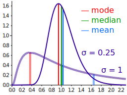
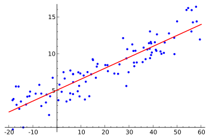
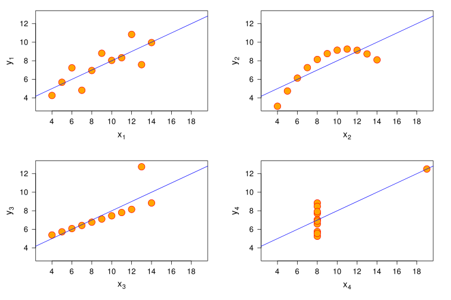

# Statistiques descriptives

- **url** = https://www.youtube.com/playlist?list=PLKOH07GkcIqfcLXmgGeuIrc5j4iB_lzjP
- **type** = playlist YouTube
- **auteur** = [Éric LOMBARDOT](https://www.pantheonsorbonne.fr/page-perso/lombardot) = maître de conférences à La Sorbonne sur des sujets marketing ou management (sciences de gestion).
- **date de publication** = 2020-11-xx : les 13 vidéos ont été publiées entre le 4 et le 13 novembre 2020.
- **source** = [sa chaîne YouTube](https://www.youtube.com/c/EricLombardot/about)
- **tags** = language>none ; topic>statistics ; topic>maths ; level>beginner

**TL;DR** : Notes très brutes sur la série de vidéos d'Éric LOMBARDOT sur les statistiques descriptives. La série de vidéo a une approche très terre-à-terre, peu formelle. Du coup, même si elle est peu mathématique, elle est intéressante pour se faire une idée des notions "avec les mains".

* [Statistiques descriptives](#statistiques-descriptives)
   * [Statistiques univariées](#statistiques-univariées)
      * [Généralités](#généralités)
         * [Indicateurs](#indicateurs)
         * [Conditions de Yule](#conditions-de-yule)
      * [Indicateurs de dispersion](#indicateurs-de-dispersion)
         * [Intervalle interquartile](#intervalle-interquartile)
         * [Écart absolu moyen](#écart-absolu-moyen)
         * [Variance, écart-type](#variance-écart-type)
      * [Moments](#moments)
      * [Indicateurs d'asymétrie](#indicateurs-dasymétrie)
      * [Indicateurs d'aplatissement](#indicateurs-daplatissement)
      * [Indicateur de concentration = indice de Gini](#indicateur-de-concentration--indice-de-gini)
   * [Statistiques bivariées](#statistiques-bivariées)
      * [Principes](#principes)
      * [Covariance](#covariance)
      * [Corrélation de Pearson](#corrélation-de-pearson)
      * [Corrélation n'est pas causalité !](#corrélation-nest-pas-causalité-)
      * [Régression linéaire](#régression-linéaire)

## Statistiques univariées

### Généralités

Analyse univariée = il n'y a qu'une seule variable (par opposition par exemple à deux variables, dont on pourrait étudier la corrélation)

#### Indicateurs

Indicateur ~ valeur qui "résume" une série statistique, pour nous renseigner sur la série sans avoir à manipuler l'ensemble des valeurs.

Plusieurs types d'indicateurs :

- indicateurs de tendance centrale : mode (=valeur la plus représentée = "pic"), moyenne, médiane
- indicateurs de dispersion : étendue (=amplitude de la série statistique), variance, écart-type, intervalles interquartiles/interdéciles
- indicateurs d'asymétrie et d'aplatissement
- ...

On voit aussi passer 3 paramètres influant sur une distribution :

- [paramètre de position](https://fr.wikipedia.org/wiki/Param%C3%A8tre_de_position)
- [paramètre d'échelle](https://fr.wikipedia.org/wiki/Param%C3%A8tre_d%27%C3%A9chelle)
- [paramètre de forme](https://fr.wikipedia.org/wiki/Param%C3%A8tre_de_forme)

#### Conditions de Yule

[Conditions de Yule](https://www.bibmath.net/dico/index.php?action=affiche&quoi=./y/yule.html) = condition pour qu'un indicateur statistique soit bon :

1. être défini de façon claire et objective (le calcul ne fait pas intervenir l'appréciation de l'observateur);
2. dépendre de toutes les observations, et ainsi avoir une signification exhaustive, ainsi qu'assurer une convergence vers une valeur limite si la taille de l'échantillon augmente;
3. être peu sensible aux valeurs extrêmes (et donc aux fluctuations d'échantillonage);
4. avoir une signification concrète (utile notamment pour présenter les résultats à des non-statisticiens);
5. être simple à calculer;
6. se prêter aisément au calcul algébrique, ce qui signifie en fait figurer naturellement dans les théorèmes ou formules du calcul des probabilités.

Les conditions ne sont jamais toutes remplies en même temps → on choisit l'indicateur qui apporte le meilleur compromis au vu de notre besoin.

### Indicateurs de dispersion

#### Intervalle interquartile

Quartile, décile, centile, quantile = généralisation de la médiane (NdM : ce sont des VALEURS)

Intervalle inter quartile = `Q3 - Q1` = distance entre Q3 et Q1.

En gros, on s'intéresse à l'amplitude de la population au milieu, qui exclut les outliers : "la moitié centrale de la population tient dans l'IIQ". Si la série est très dispersée, Q3 et Q1 seront très éloignées.

NdM = Q1 et Q3 sont utilisés dans les fameuses [boîtes à moustache](https://fr.wikipedia.org/wiki/Bo%C3%AEte_%C3%A0_moustaches).

Intervalle interdecile = D9 - D1

#### Écart absolu moyen

Écart absolu moyen = moyenne des écarts à la moyenne (ou médiane)... En valeur absolue ! (Pour éviter que les écarts s'annulent)

#### Variance, écart-type

Variance et écart type sont des indicateurs de dispersion.

Variance = moyenne des carrés des écarts à la moyenne. (Carrés pour éviter que les écarts ne se compensent)

Écart type `σ` : si loi normale, 68% sont à `+/- σ`, et 95% à `+/- 2σ`.

Décomposition de la variance intra et inter population : si la population se décompose en deux sous-types de populations, la variance s'explique par la contribution de chaque type de population (en gros, la part de la variance au sein du sous-type 1, et de la variance 2 au sein du sous-type 2).

Coefficient de variation = écart type divisé par moyenne : permet en quelques sorte de normaliser la dispersion.

### Moments

Moment d'ordre `r` par rapport à une origine `a` = la moyenne des "écarts à `a` élevés à la puissance `r`" = `1/n . Σ (x-a)^r`

- moment simple = quand `a = 0` (exemple : la moyenne est le moment simple d'ordre 1)
- moment centré = si `a` vaut la moyenne arithmétique (exemple : la variance est le moment centré d'ordre 2)

Les moments centrés d'ordre 2, 3 ou 4 renseignent sur l'asymétrie ou l'aplatissement.

Aha ! Il y a des formules permettant d'exprimer les moments centrés à partir des moments simples d'ordres inférieurs... C'est intéressant car les moments centrés sont compliqués à calculer.

Ces formules sont une généralisation du [théorème de König-Huygens](https://fr.wikipedia.org/wiki/Th%C3%A9or%C3%A8me_de_K%C3%B6nig-Huygens) qui donne la variance comme égale à la moyenne des carrés moins le carré de la moyenne : `Var(X) = E(X²) - E(X)²`

### Indicateurs d'asymétrie

Asymétrie (skewness) = quand la dispersion est faible à droite, et élevée à gauche (ou inversement). Dit autrement : la distribution a une queue longue à droite, mais pas à gauche.

Exemple de distribution étalée vers la droite = distribution des salaires : il existe beaucoup de gens à faible salaire, mais il n'y a que peu de gens à haut salaire.

Pour calculer l'asymétrie avec un indicateur, il faut travailler sur une distribution unimodale (i.e. avec un seul pic). En effet, c'est un autour de ce pic que la notion d'asymétrie à un sens (alors qu'elle n'en a pas, ou en tout cas, pas exprimable avec la skewness, s'il y a plusieurs pics).

Coefficient d'asymétrie de Yule = fait intervenir les quartiles (pour calculer si Q3 est plus éloigné de la médiane que Q1)

Coefficient d'asymétrie de Pearson : formule exprimant le fait que mode et moyenne (le tout normalisé par l'écart type) sont d'autant plus éloignées que la distribution est asymétrique. En effet, si la distribution est très asymétrique (donc très déséquilibrée), la médiane est plus au centre que la moyenne (c'est l'une des raisons pour lesquelles la médiane est plus robuste que la moyenne) :

(source de l'image = [wikipedia](https://commons.wikimedia.org/wiki/File:Comparison_mean_median_mode.svg))

Deuxième Coefficient d'asymétrie de Pearson = rapport des moments centrés 2 et 3, un peu compliqué, mais intéressant quand il y a beaucoup d'individus.

Coefficient d'asymétrie de Fischer = racine du précédent.

### Indicateurs d'aplatissement

Indicateurs d'aplatissement (kurtosis). Caractérise à quel point le pic est pointu ou smooth :

(source de l'image = [wikipedia](https://commons.wikimedia.org/wiki/File:Standard_symmetric_pdfs.svg))

Coefficient d'aplatissement de Pearson.

Coefficient d'aplatissement de Fischer

Fait partie des paramètres de forme = qui donnent la forme de la courbe.

### Indicateur de concentration = indice de Gini

Concentration : indiqué à quel point un petit nombre d'individus concentrent beaucoup des valeurs.

Indice de Gini. Indicateur des inégalités. Se définit graphiquement

## Statistiques bivariées

### Principes

Étude du lien entre deux phénomènes: sont-ils indépendants ou dépendent-ils l'un de l'autre ?

Attention : il y a **beaucoup** d'erreurs d'interprétation possibles avec les liens de dépendance entre deux phénomènes ! Notamment, le _sens de la relation_ (quelle variable a une influence sur l'autre ?) n'est pas facile... Il faut donc de l'humilité dans les interprétations (more on this later).

Chacune des deux variables peut être qualitative ou quantitative, et les tests ne sont pas les mêmes en fonction des trois cas :

- quantitative + quantitative
- quantitative + qualititative
- qualititative + qualititative

La [vidéo 13](https://www.youtube.com/watch?v=ewtoSal-HQY) présente pas mal de conventions et de notations. Notamment : x avec deux barres au dessus est la moyenne selon les deux dimensions.

Le principe est que pour une même population d'individus, chaque individu présente deux scores (deux variables), selon deux dimensions orthogonales. Attention : ça n'est PAS qu'on a deux populations, on n'a bien QU'UNE SEULE population, mais chaque individu a deux caractéristiques.

Graphiquement, si on trace les valeurs possibles pour l'une des caractéristiques en abscisse, et l'autre en ordonnée, chaque individu est un point sur graphique, et la population est donc un nuage de points :

(source de l'image = [wikipedia](https://commons.wikimedia.org/wiki/File:Linear_regression.svg))

### Covariance

Dans quelle mesure les variations de deux variables sont simultanées ? L'idée est de regarder si les écarts à la moyenne suivent la même tendance. Pour cela, covariance = multiplication des écarts x par les écarts y

La covariance est un peu l'équivalent en bivarié de la variance en univarié (et la corrélation de Pearson ci-dessous est l'équivalent de l'écart-type). Comme la variance, la covariance est un indicateur d'ordre 2, donc déjà difficile à interpréter à la base. Mais par rapport à la variance, c'est encore plus dur, car l'unité de la covariance est le produit des unités de chaque dimension.

### Corrélation de Pearson

Indique le degré de dépendance linéaire entre deux variable quantitatives.

Sur le graphique plus haut, le degré de dépendance serait indiqué par "à quel degré les points sont éloignés de la droite".

La corrélation de Pearson `R` est comprise dans `[-1;1]`, c'est la covariance divisée par le produit des écarts-type de chaque variable : `R = cov(XY) / σ(X).σ(Y)`

Attention : `R` est limité aux relations LINÉAIRES, et ne détecte pas les relations existantes entre deux variables (qui sont très liées), mais plus complexes, comme celles de la troisième ligne ci-dessus :

(source de l'image = [wikipedia](https://commons.wikimedia.org/wiki/File:Correlation_examples2.svg))

[Quartet d'Anscombe](https://fr.wikipedia.org/wiki/Quartet_d%27Anscombe) = attention à bien tracer le graphique des données avant d'en analyser les propriétés statistiques ! Les 4 séries statistiques ci-dessous **ont les mêmes propriétés statistiques**, mais sont très différentes :

(source de l'image = [wikipedia](https://commons.wikimedia.org/wiki/File:Anscombe.svg))

### Corrélation n'est pas causalité !

Corrélation n'est pas causalité, il y a plusieurs exemples à [05:33](https://www.youtube.com/watch?v=ciqcsWqIHIQ&t=333s) très intéressants, où deux variables X et Y sont corrélées, mais où la corrélation est à interpréter différemment :

- X influence directement Y (exemple : l'ancienneté dans la fonction publique influence directement la rémunération)
- X influence W qui influence Y (exemple : l'âge d'un fonctionnaire influence son ancienneté, qui influence directement sa rémunération)
- X et Y s'influencent mutuellement (exemple : la motivation au travail influe sur la rémunération, et la rémunération influe sur la motivation au travail)
- X et Y sont influencés par une troisième variable externe Z (exemple : manger bio est corrélé au fait d'avoir moins de cancer, mais les deux facteurs s'expliquent plutôt par "avoir un style de vie sain")
- X et Y sont corrélés, mais ne s'influencent pas (exemple : le nombre de noyades dans les piscines et le nombre de films dans lesquels Nicholas CAGE joue. [Cette page](https://www.tylervigen.com/spurious-correlations) agrège d'autres exemples dans le même genre)

Voir aussi [effet cigogne](https://fr.wikipedia.org/wiki/Cum_hoc_ergo_propter_hoc).

`R2` = Coefficient de détermination = pourcentage des variations de Y imputable à X (à n'utiliser QUE si le lien de causalité est établi !)

### Régression linéaire

Régression = approcher une variable X à partir d'une variable Y qui lui est corrélée : si je connais le nombre d'heures quotidiennes passées devant la télé, j'ai accès au nombre de livres lus par an.

Terminologie :
- variable explicative = la variable qui influence
- variable à expliquer = la variable influencée

Ici aussi, attention aux interprétations ! Attention également (s'il y a plus que deux variables Y à expliquer, et X1, X2, X3 explicatives) aux corrélation entre les variables explicatives !

La régression est linéaire si `Y` s'exprime comme une équation affine des `Xi`.

Méthode la plus utilisée pour trouver une régression linéaire = [méthode des moindres carrés](https://fr.wikipedia.org/wiki/M%C3%A9thode_des_moindres_carr%C3%A9s) :

- l'objectif est de trouver la "meilleure" droite `y = ax + b` qui passe par le nuage de points, on cherche à trouver `a` et `b`
- cette "meilleure" droite passe par le point moyen de la série statistique et minimise les écarts au carré
- point moyen = son abscisse est la moyenne de `X`, et son ordonnée la moyenne des `Y`
- le coefficient directeur `a` est le rapport `cov(XY) / var(X)`
- derrière, l'ordonnée à l'origine `b` est imposé par le fait que la droite passe par le point moyen

La régression linéaire permet de réaliser des prévisions : une fois qu'on connait `a` et `b`, étant donné un `x` donné (e.g. "je passe 3 heures quotidiennes devant la télé"), alors on peut prévoir le `y` ("alors je lis 7 livres par an"). Mais la fiabilité dépend de l'interprétation donnée aux variables...

(il y a également une vidéo de révisions générales, mais on dirait que ce ne sont que des applications numériques → je saute)
