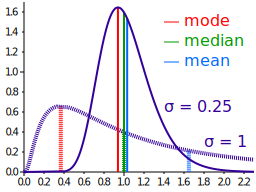
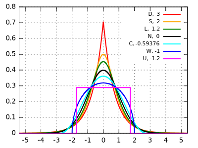

# Statistiques descriptives — statistiques univariées

- **url** = https://www.youtube.com/playlist?list=PLKOH07GkcIqfcLXmgGeuIrc5j4iB_lzjP
- **type** = playlist YouTube
- **auteur** = [Éric LOMBARDOT](https://www.pantheonsorbonne.fr/page-perso/lombardot) = maître de conférences à La Sorbonne sur des sujets marketing ou management (sciences de gestion).
- **date de publication** = 2020-11-xx : les 13 vidéos ont été publiées entre le 4 et le 13 novembre 2020.
- **source** = [sa chaîne YouTube](https://www.youtube.com/c/EricLombardot/about)
- **tags** = language>none ; topic>statistics ; topic>maths ; level>beginner

**TL;DR** : Notes très brutes sur la série de vidéos d'Éric LOMBARDOT sur les statistiques descriptives. La série de vidéo a une approche très terre-à-terre, peu formelle. Du coup, même si elle est peu mathématique, elle est intéressante pour se faire une idée des notions "avec les mains".

* [Statistiques descriptives — statistiques univariées](#statistiques-descriptives--statistiques-univariées)
* [Généralités](#généralités)
   * [Indicateurs](#indicateurs)
   * [Conditions de Yule](#conditions-de-yule)
* [Indicateurs de dispersion](#indicateurs-de-dispersion)
   * [Intervalle interquartile](#intervalle-interquartile)
   * [Écart absolu moyen](#écart-absolu-moyen)
   * [Variance, écart-type](#variance-écart-type)
* [Moments](#moments)
* [Indicateurs d'asymétrie](#indicateurs-dasymétrie)
* [Indicateurs d'aplatissement](#indicateurs-daplatissement)
* [Indicateur de concentration = indice de Gini](#indicateur-de-concentration--indice-de-gini)

# Généralités

Analyse univariée = il n'y a qu'une seule variable (par opposition par exemple à deux variables, dont on pourrait étudier la corrélation)

## Indicateurs

Indicateur ~ valeur qui "résume" une série statistique, pour nous renseigner sur la série sans avoir à manipuler l'ensemble des valeurs.

Plusieurs types d'indicateurs :

- indicateurs de tendance centrale : mode (=valeur la plus représentée = "pic"), moyenne, médiane
- indicateurs de dispersion : étendue (=amplitude de la série statistique), variance, écart-type, intervalles interquartiles/interdéciles
- indicateurs d'asymétrie et d'aplatissement
- ...

On voit aussi passer 3 paramètres influant sur une distribution :

- [paramètre de position](https://fr.wikipedia.org/wiki/Param%C3%A8tre_de_position)
- [paramètre d'échelle](https://fr.wikipedia.org/wiki/Param%C3%A8tre_d%27%C3%A9chelle)
- [paramètre de forme](https://fr.wikipedia.org/wiki/Param%C3%A8tre_de_forme)

## Conditions de Yule

[Conditions de Yule](https://www.bibmath.net/dico/index.php?action=affiche&quoi=./y/yule.html) = condition pour qu'un indicateur statistique soit bon :

1. être défini de façon claire et objective (le calcul ne fait pas intervenir l'appréciation de l'observateur);
2. dépendre de toutes les observations, et ainsi avoir une signification exhaustive, ainsi qu'assurer une convergence vers une valeur limite si la taille de l'échantillon augmente;
3. être peu sensible aux valeurs extrêmes (et donc aux fluctuations d'échantillonage);
4. avoir une signification concrète (utile notamment pour présenter les résultats à des non-statisticiens);
5. être simple à calculer;
6. se prêter aisément au calcul algébrique, ce qui signifie en fait figurer naturellement dans les théorèmes ou formules du calcul des probabilités.

Les conditions ne sont jamais toutes remplies en même temps → on choisit l'indicateur qui apporte le meilleur compromis au vu de notre besoin.

# Indicateurs de dispersion

## Intervalle interquartile

Quartile, décile, centile, quantile = généralisation de la médiane (NdM : ce sont des VALEURS)

Intervalle inter quartile = `Q3 - Q1` = distance entre Q3 et Q1.

En gros, on s'intéresse à l'amplitude de la population au milieu, qui exclut les outliers : "la moitié centrale de la population tient dans l'IIQ". Si la série est très dispersée, Q3 et Q1 seront très éloignées.

NdM = Q1 et Q3 sont utilisés dans les fameuses [boîtes à moustache](https://fr.wikipedia.org/wiki/Bo%C3%AEte_%C3%A0_moustaches).

Intervalle interdecile = D9 - D1

## Écart absolu moyen

Écart absolu moyen = moyenne des écarts à la moyenne (ou médiane)... En valeur absolue ! (Pour éviter que les écarts s'annulent)

## Variance, écart-type

Variance et écart type sont des indicateurs de dispersion.

Variance = moyenne des carrés des écarts à la moyenne. (Carrés pour éviter que les écarts ne se compensent)

Écart type `σ` : si loi normale, 68% sont à `+/- σ`, et 95% à `+/- 2σ`.

Décomposition de la variance intra et inter population : si la population se décompose en deux sous-types de populations, la variance s'explique par la contribution de chaque type de population (en gros, la part de la variance au sein du sous-type 1, et de la variance 2 au sein du sous-type 2).

Coefficient de variation = écart type divisé par moyenne : permet en quelques sorte de normaliser la dispersion.

# Moments

Moment d'ordre `r` par rapport à une origine `a` = la moyenne des "écarts à `a` élevés à la puissance `r`" = `1/n . Σ (x-a)^r`

- moment simple = quand `a = 0` (exemple : la moyenne est le moment simple d'ordre 1)
- moment centré = si `a` vaut la moyenne arithmétique (exemple : la variance est le moment centré d'ordre 2)

Les moments centrés d'ordre 2, 3 ou 4 renseignent sur l'asymétrie ou l'aplatissement.

Aha ! Il y a des formules permettant d'exprimer les moments centrés à partir des moments simples d'ordres inférieurs... C'est intéressant car les moments centrés sont compliqués à calculer.

Ces formules sont une généralisation du [théorème de König-Huygens](https://fr.wikipedia.org/wiki/Th%C3%A9or%C3%A8me_de_K%C3%B6nig-Huygens) qui donne la variance comme égale à la moyenne des carrés moins le carré de la moyenne : `Var(X) = E(X²) - E(X)²`

# Indicateurs d'asymétrie

Asymétrie (skewness) = quand la dispersion est faible à droite, et élevée à gauche (ou inversement). Dit autrement : la distribution a une queue longue à droite, mais pas à gauche.

Exemple de distribution étalée vers la droite = distribution des salaires : il existe beaucoup de gens à faible salaire, mais il n'y a que peu de gens à haut salaire.

Pour calculer l'asymétrie avec un indicateur, il faut travailler sur une distribution unimodale (i.e. avec un seul pic). En effet, c'est un autour de ce pic que la notion d'asymétrie à un sens (alors qu'elle n'en a pas, ou en tout cas, pas exprimable avec la skewness, s'il y a plusieurs pics).

Coefficient d'asymétrie de Yule = fait intervenir les quartiles (pour calculer si Q3 est plus éloigné de la médiane que Q1)

Coefficient d'asymétrie de Pearson : formule exprimant le fait que mode et moyenne (le tout normalisé par l'écart type) sont d'autant plus éloignées que la distribution est asymétrique. En effet, si la distribution est très asymétrique (donc très déséquilibrée), la médiane est plus au centre que la moyenne (c'est l'une des raisons pour lesquelles la médiane est plus robuste que la moyenne) :

(source de l'image = [wikipedia](https://commons.wikimedia.org/wiki/File:Comparison_mean_median_mode.svg))

Deuxième Coefficient d'asymétrie de Pearson = rapport des moments centrés 2 et 3, un peu compliqué, mais intéressant quand il y a beaucoup d'individus.

Coefficient d'asymétrie de Fischer = racine du précédent.

# Indicateurs d'aplatissement

Indicateurs d'aplatissement (kurtosis). Caractérise à quel point le pic est pointu ou smooth :

(source de l'image = [wikipedia](https://commons.wikimedia.org/wiki/File:Standard_symmetric_pdfs.svg))

Coefficient d'aplatissement de Pearson.

Coefficient d'aplatissement de Fischer

Fait partie des paramètres de forme = qui donnent la forme de la courbe.

# Indicateur de concentration = indice de Gini

Concentration : indiqué à quel point un petit nombre d'individus concentrent beaucoup des valeurs.

Indice de Gini. Indicateur des inégalités. Se définit graphiquement

