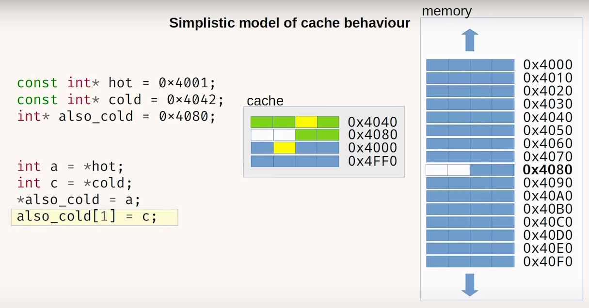

# What do you mean by cache friendly ?

- **url** = https://www.youtube.com/watch?v=Fzbotzi1gYs
- **type** = vidéo
- **auteur** = Björn FAHLLER = dev avec 25 ans d'expérience, [son blog](https://playfulprogramming.blogspot.com/), [son twitter](https://twitter.com/bjorn_fahller), [son github](https://github.com/rollbear)
- **date de publication** = 2020-01-13
- **source** = [la chaîne youtube](https://www.youtube.com/c/codediveconference) de [code::dive](https://twitter.com/code_dive_pl?lang=fr) = une conf IT polonaise

- **tags** = language>C++ ; topic>cache ; level>intermediate


**TL;DR** : je reprends [ses rules of thumb](https://www.youtube.com/watch?v=Fzbotzi1gYs&t=3274s) en fin de vidéo, qui sont un bon résumé pratique de sa prez :

- _following a pointer is a cache miss (unless contrary information)_
- _smaller working data set is better_
- _use as much of a cache entry as you can_
- _sequential memory accesses can be very fast due to prefetching_
- _fewer evicted cache lines means more data in hot cache for the rest of the program_
- _mispredicted branches CAN evict cache lines_
- _measure measure measure_

**02:50** = son cas test qu'il va améliorer petit à petit tout au long de la présentation = on passe tout le temps dans une fonction `schedule_timer` :
- une structure timer avec une deadline, une callback
- les timers sont conservés dans une double-linked-list
- la sentinelle de la linked-list est un timer "timeout"
- dans la linked-list, les timers sont maintenus ordonnés par deadline (le premier élément est "timeout", le suivant est celui ayant la plus petite deadline, etc.)
- `schedule_timer` ajoute un nouveau timer, en itérant sur tous les timers existants (en commençant par timeout) et en s'insérant juste avant le premier ayant une deadline plus grande

**04:20** = lors de ses tests, il avait entre 20 et 30 timers (et ça ne posait pas de souci) ; quand il a benchmarké, il avait 25k timers, et c'est là que les soucis ont commencé.

**04:50** = modèle mental simplifié du cache :
- cache is small
- cache consists of fixed size cache-lines
- data hit = fast / data miss = slow
- (exclu du modèle mental = les multiples niveaux, la cache-associativity, cache-data à partager entre les cores (hint = À ÉVITER !)
- le modèle est simplifié : la réalité est bien plus complexe, mais le modèle est suffisant pour permettre au dev de réfléchir à son software design



**06:30** = explications de comment lectures/écritures fonctionnennt avec son modèle simplifié

**09:00** = il benchmarke son scheduling de timers avec un main qui boucle + exécution avec valgrind
    ```
    valgrind --tool=callgrind --cache-sim=yes --dump-instr=yes --branch-sim=yes
    ```
- le plus important est --cache-sim=yes : valgrind va donner des infos sur le caching (en émulant les mêmes paramètres de cache que celui du CPU actuel, un peu simplifiés)
- 2.5 milliards d'instructions
- 70% D1 miss !
- nombre de branch mispredict négligeable
- `kcachegrind` = visualization tool = on voit OÙ on passe les cache-miss (dans `schedule_timer`)

**16:00** analyse :
- rule-of-thumb = à chaque fois qu'on doit déréférencer un pointeur, il faut supposer qu'on va avoir un cache miss
- son analyse des 33% est intéressante :
    - on a en cache la structure timer
    - on essaye d'accéder à une donnée (timer->prev) dont l'adresse est située à 32 bits d'écart de l'adresse de timer
    - la cacheline sur ce CPU fait 64 bits
- CONCLUSION = environ un accès à timer->prev sur deux sera du cache-miss (ce qui explique qu'on a tout pile deux fois moins de cache-miss pour timer->prev que pour timer)

**17:30** = première amélioration = se passer des pointeurs
- il n'utilise plus une linked-list pour stocker les timers, mais un vector (tous les timers sont contigüs en mémoire)
- pour insérer un nouveau timer, on part de la fin du vector, et on insère le nouveau  timer dès qu'on trouve sa place
- son point : c'est un GROS travail (on doit move tout un tas de timers en mémoire pour "insérer" le nouveau), ça se traduit par BEAUCOUP d'instructions

**18:55** perf :
    ```
    perf stat -e cycles,instructions,l1d-loads,l1d-load-misses
    ```
- on exécute le programme, et on agrège les statistiques
- note : le nombre de cycles par instruction est une mesure d'à quel point le CPU est plutôt occupé à bosser, ou à attendre
- très rapide, peu d'overhead
    ```
    perf record  -e cycles,instructions,l1d-loads,l1d-load-misses --call-graph=lbr
    ```
- `call-graph = lbr` à essayer (pour savoir où on est dans la callstack, ne nécessite pas de compilation flags ; alternative à frame-pointer ou à dwarf)

**22:10** : run avec linked_list = mêmes chiffres que valgrind : 2.5 milliards d'instructions, 70% de cache miss (et 3.6 secondes pour l'exécution : le profiling avec perf est bien plus rapide que valgrind)

**22:40** : run avec linear_array = 7.2 milliards d'instruction (presque 3 fois plus de taf !), 22% de cache miss, et seulement 0.8s (exécution 4 fois plus rapide, alors qu'on fait trois fois plus de taf !)
- notamment, on fait plus de data-load, mais avec beaucoup moins de data-load miss
- avec perf record au lieu de perf stat (pour voir où on passe du temps)

**25:00** les cache miss sont tous sur `memmove`
- KEYPOINT : doing more work can be faster than doing less = la surprise avec les CPU cache

**26:00** = essai de trouver le point d'insertion du nouveau timer avec binary-search, plutôt que de rechercher linéairement depuis l'arrière du vector ordonné des timers
- 0.48s (presque 2 fois plus rapide), beaucoup beaucoup moins d'instructions, mais on est de retour à 99% (voire parfois plus de 100% !) de cache miss
- (le dépassement s'explique par le fait que l'exécution spéculative par le CPU d'une branche non-empruntée peut tout de même provoquer des cache-miss, qui sont comptabilisés comme cache-miss, alors que le data-load correspondant n'est pas comptabilisé comme data-load si la branche n'est au final pas retenue : on peut ainsi obtenir un taux de cache-miss supérieur à 100%)
    - quand il analyse où on passe du temps, c'est systématiquement dans `memmove`
    - à chaque fois qu'on essaye d'optimiser les accès à la mémoire, on finit toujours par tomber sur le fait que memmove est le bottleneck
    - et dans ce cas, la bonne solution n'est pas d'écrire un faster memmove, mais plutôt d'éviter l'appel à memmove
    - NdM : le memmove semble être dû au fait de "décaler" les timers une fois qu'on a trouvé le bon point d'insertion du nouveau timer

**30:00** : du coup, essayer une `std::map` ?
- le binary_search est intégré à la map + comme on a un tree plutôt qu'un vector, on n'aura pas besoin de memmove ? (NdM : mais on se retrouve avec du pointer-chasing ?)
- (utiliser -01 est un bon compromis pour investiguer les problèmes de perfs : -O0 est trop bête, -O2 modifie trop le code, -O1 est un bon compromis)
- exécution avec une map : 0.06 secondes (presque 10 fois plus rapide que le précédent) ; 100M instructions (donc BEAUCOUP moins), 7% de cache miss, et (c'est nouveau) 7% de branche mispredicted...
- (note : perf report pour analyser un profil perf enregistré avec perf record)
- faster, mais beaucoup de cache miss quand on compare les clés et qu'on rebalance le tree

**36:30** : comportement asymptotique = les comparaisons entre linear, map et bsearch ne sont bons qu'avec BEAUCOUP de timers (ce qui n'est pas forcément le cas dans les cas réels hors benchmark)

**37:45** = on veut récupérer "le prochain timer à exécuter" rapidement, et sans pointer-chasing -> heap
- explications du principe (= arbre binaire toujours rempli au max sauf éventuellement le dernier node, chaque parent est plus petit que ses fils, insertion élément à la fin + ajustement, suppression du head + ajustement avec le dernier élément, stockage dans un vector)
- stockage dans un vector -> pas de pointeur à chase
- MAIS ce qui est compliqué, c'est de SUPPRIMER un élément du heap (et on a besoin de le faire pour pouvoir cancel des timers)
- contournement = il sette la callback à un pointeur nul -> on GARDE un timer cancelled, mais son exécution devient un noop (shoot_first devient un poil plus complexe, puisqu'il faut ignorer tous les timers noop et exécuter le premier timer non-noop)
- (problème = la data-structure n'est plus réduite en taille lorsqu'on cancel des timers)

**43:30** = exécution :
- heap environ 2 fois plus rapide que map
- un peu moins d'instructions
- beaucoup moins de load, et un peu moins de cache-miss
- beaucoup moins de branches, et un peu moins de mispredicted-branch
- avec ça, les opérations en O(1) deviennent prépondérantes -> on devient assez efficace
- les cache-miss sont localisés dans l'ajustement du heap (NdM : c'est pas hyper clair pourquoi, à froid je vois 1. que quand on delete, on chase le pointeur vers la callback et 2. que le heap ne tient tout simplement pas en cache -> c'est normal d'avoir des cache miss quand on le mets à jour)

NdM : en plus du cache, le talk est également une ode à l'utilisation des data-structures appropriées à son problème !

**45:45** = chiffres : en asymptotique, heap déchire tout MAIS ce qui est cool, c'est que sauf pour les tout petits tableaux (moins de 100 timers, où linear est better), heap est également better avec des tableaux réalistes

**46:30** : comment réduire les cache-miss sur le heap ?
- il montre des visuels très parlants pour expliquer qu'en stockant le heap classiquement dans un vector, on est obligés de traverser autant de cache-line que de niveau pour manipuler le heap
- il propose donc de stocker les items du heap de façon à rendre la traversée de l'arbre plus cache friendly (i.e. en essayant de maximiser le fait qu'un parent et son node-fils soit sur la même cache-line)
- le code devient beaucoup plus chevelu
- la structure a un nom = b-heap :
    - https://en.wikipedia.org/wiki/B-heap
    - A B-heap is a binary heap implemented to keep subtrees in a single page.
    - This reduces the number of pages accessed by up to a factor of ten for big heaps when using virtual memory, compared with the traditional implementation
    - (NdM : le focus est donc mis sur la réduction des page-miss par le TLB, mais à plus petite échelle, le même principe s'applique pour le cache)
- pas beaucoup plus rapide (voire même un peu plus lent)
- par contre, on confirme qu'on réduit les cache-miss
- (par contre on a plus d'instructions, car la logique est beaucoup plus complexe)

**53:00** message important = attention avec le microbenchmark :
- là, si on oublie un peu le benchmark et qu'on en revient au vrai système, le vrai système schedule des timers ET fait des actions
- du coup, le micro-beanchmark a beau être équivalent avec le bheap et avec le heap, si on a moins de cache-miss avec le bheap, on gardera plus de cache-line pour le vrai programme !

**54:30** : rules of thumb :
- following a pointer is a cache miss (unless contrary information)
- smaller working data set is better
- use as much of a cache entry as you can
- sequential memory accesses can be very fast due to prefetching
- fewer evicted cache lines means more data in hot cache for the rest of the program
- mispredicted branches CAN evict cache lines
- measure measure measure

Un message qu'il ajoute dans les questions : s'intéresser à la complexité asymptotique n'est intéressant que quand on a beaucoup de données ! (a contrario, même si on n'a pas beaucoup de données, pointer-chasing reste bad et linear-memory access reste good)

Un autre point dans les questions (avec lequel je suis bien d'accord !) = linked-list devrait être le dernier recours quand rien d'autre ne marche.
