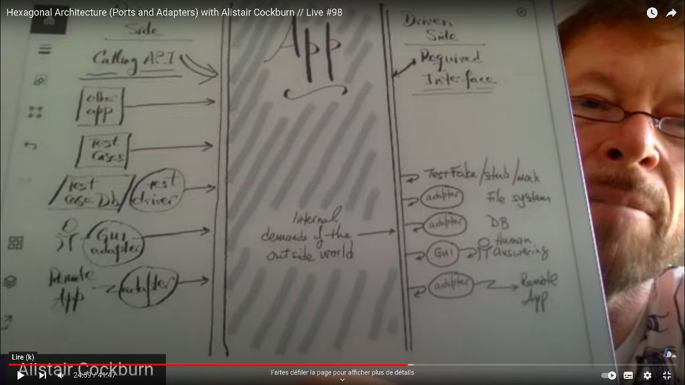
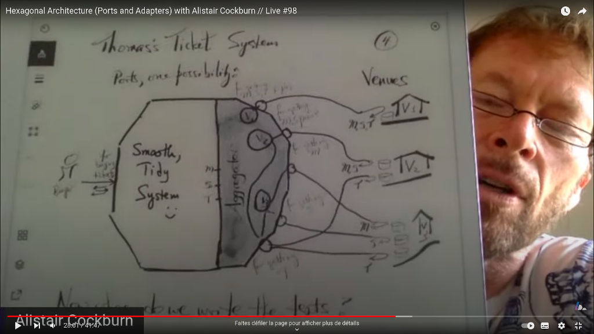

# Hexagonal Architecture (Ports and Adapters) with Alistair Cockburn

- **url** = https://www.youtube.com/watch?v=AOIWUPjal60
- **type** = vidéo
- **auteur** = [Alistair COCKBURN](https://fr.wikipedia.org/wiki/Alistair_Cockburn) = architecte, co-auteur du manifeste agile
- **date de publication** = 2022-05-27
- **source** = le live de [Rodrigo BRANAS](https://www.youtube.com/@RodrigoBranas/about), un dev portugais intéressé par des sujets de quality.
- **tags** = language>agnostic ; topic>architecture ; level>intermediate

TODO = revenir reformuler le paragraphe concernant l'anti-corruption layer (et éventuellement en toucher un mot dans mes notes de synthèse ?)

Une excellente vidéo qui donne la philosophie derrière l'architecture ports-and-adapters a.k.a hexagonal-architecture. Je tente un résumé des principes :

- les interactions d'une app avec le monde extérieur sont de deux types :
    - à gauche, quelque chose du monde extérieur (un humain via une GUI, un script de test, ...) **drive** l'application
    - à droite, l'application **utilise** quelque chose du monde extérieur (e.g. une DB pour accéder à de la donnée, une GUI pour afficher quelque chose à un utilisateur, etc.)
- l'application définit des **ports** = les interfaces représentant ces interactions avec le monde extérieur :
    - à gauche, un port est une calling-API exposée par l'application et permettant de l'utiliser
    - à droite, un port est une required-interface que l'application utilise (et qui doit être implémentée concrètement pour fournir le service à l'application)
- un **adapter** est une implémentation concrète d'un port :
    - exemples à gauche : un adapter pour driver l'application via une GUI, un autre pour driver l'application via un test automatique, ...
    - exemples à droite : un adapter pour utiliser une DB réelle, un autre pour utiliser une in-memory database pour les tests unitaires
- ce qui est représenté à l'intérieur de l'hexagone, c'est le coeur de l'application et ses ports (mais pas les adapters, même si "la vraie application" complète est consituée aussi d'un adapter réel pour chacun de ses ports)
- la clé, c'est que toute interaction avec le monde extérieur doit faire l'objet d'un port :
    - en production, l'app utilise des adapters de prod (e.g. un adapter GUI drive l'app, et un adapter postgreSQL implémente le port d'accès aux données)
    - mais le coeur de l'application (l'hexagone) reste testable avec des adapters de test : un adapter automated-script drive alors l'app, et un adapater InMemoryDB implémente le port d'accès aux données
- NdM = attention qu'il n'y a pas un mapping entre gauche+droite et entrées+sorties : ma compréhension des choses, c'est que chaque port peut servir aux deux :
    - un port à gauche peut être plutôt classé input si son adapter permet de lire ce que l'utilisateur frappe au clavier
    - le même port à gauche peut également être classé output si son adapter va afficher à l'écran ce que l'app lui renvoie
    - un port à droite peut être plutôt classé input s'il permet à l'application de recevoir des infos, e.g. de la part d'un humain qui répond au clavier à une question CLI de l'app
    - le même port à droite peut être plutôt classé output s'il permet à l'application d'afficher des infos, e.g. d'afficher un status sur une ligne de terminal
- du coup, ce qui différencie droite et gauche, c'est plutôt **qui drive** = qui initie la conversation :
    - **driver side** = les ports à gauche sont utilisés **à l'initiative du monde extérieur** pour communiquer avec l'app
    - **driven side** = les ports à droite sont utilisés **à l'initiative de l'app** pour communiquer avec le monde extérieur

Par ailleurs, il mentionne un mec qui a fait un site super

TODO
TODO
TODO

Mon avis sur une limitation = 
    - NdM : et on voit là une limitation du pattern à mes yeux = beaucoup de la valeur ajoutée de l'app finale, celle qui est réellement utilisée par les utilisateur en utilisant les adapters-de-prod, peut se retrouver dans l'implémentation des adapters-de-prod.
    - exemple : la valeur ajoutée peut être dans le fait de binder un ctrl+clic sur la map au déplacement du marqueur source

---

- 8:30 ports and adapters ou hexagonal architecture ? Les deux dénominations sont correctes, Alistair préfère hexa car plus court.
- 11:20 chaque côté de l'hexagone est une conversation bidirectionnelle, avec une INTENTION ; les intentions sont des primary actors dans [le modèle "use case"](https://en.wikipedia.org/wiki/Use_case).
- 12:00 un regular user, un administrateur, et un mainteneur auront trois conversations différentes avec l'application.
- L'aspect "port" est à prendre au sens protocolaire = un _Access port_
- 14:00 expérience vécue = un dev backend s'est maquée avec la DB. Il ne pouvait plus la couper pour utiliser le système sans celle-ci.
    - NdM = ça résonne avec un cas observé professionnellement, où le moteur était fortement maqué à la DB, et où l'une des premières actions d'un dev expérimenté sur le sujet a été de découpler les deux...
- Ce qu'il faut faire = couper le lien sur la partie droite (ce que l'app utilise) : internet, une db, un système à qui on envoie un mail ou une notification
- 15:30 = l'intérêt des ports, c'est de pouvoir créer plusieurs adapters correspondant et de swapper les technos qu'on branche à droite sans avoir à modifier l'hexagone.
- C'est cette partie qui est la plus mal comprise par les devs
- 16:30 input from screen : si l'application est couplée au screen, quand on veut la driver avec le network à la place, ça ne marche pas. Ce qu'il faut, c'est pouvoir brancher n'importe quel driver (screen ou network).
- 18:30 il faut pouvoir couper les deux côtés :
    - à gauche = qui drive l'app
    - à droite = quelles sont les couches plus bas niveau que l'app utilise (ici, c'est l'app qui drive)
- 19:00 ces découplages facilitent le unit testing (fun fact, c'est pas du tout pour ça qu'Alistair a inventé le pattern)
- 20:00 il faut découper l'application , qui ne doit être connectée à rien : une pure API
- il mentionne la notion de ["required interface" par Martin Fowler](https://martinfowler.com/bliki/RequiredInterface.html) comme analogie avec le port de droite : c'est une interface dont l'application a besoin pour mener la conversation avec le monde extérieur.
- à gauche, l'app déclare son API, elle l'impose à ses drivers (i.e. les gens qui veulent utiliser l'application doivent utiliser l'API prévue pour) ; et idem à droite = si on veut pouvoir utiliser un truc à droite, ce truc doit implémenter la required-interface = le port à droite.
- on peut tout aussi bien brancher des fakes/test double (pour tester l'application) qu'avoir une vraie app (avec une vraie gui/des vraies database)
- 21:30 d'où le concept important : une app qui flotte dans l'espace connectée à rien : l'application est une island, isolée (notamment du client)
- 24:00 autre façon de dessiner le principe :
    
    - à gauche = **driver side**, c'est le driver de l'app = ceux qui pilotent l'application (ça peut être plein de trucs), tout le monde utilise la même chose = la calling-API de l'application.
    - à droite = **driven side** = ceux qui sont pilotés par l'application = ce que l'app utilise pour faire son boulot = le filesystem / la dB / une sous-app / voire des réponses d'un humain via une GUI !
- De ce côté droit, les driven (NdM : je me plais à les appeler les dépendances, même si le concept est introduit différemment) sont interrogés avec une "required interface" = une interface que l'app définit "je veux discuter avec qqun (dépendre de qqun) qui présente cette interface".
- Dans les deux côtés, pour satisfaire à la contrainte (calling-API ou required-interface), on peut si besoin utiliser un adapter (au sens design pattern, ce coup-ci) entre l'app et "le truc externe"
- les ports (et leurs adapters) sont donc bien des DEUX côtés
- Ndm : pour savoir quoi est de quel côté, c'est plus facile de penser en terme de "qui pilote" plutôt que de savoir si ça entre dans l'application.
- 25:00 le fait qu'il existe réellement différents adapters pour un port donné est moins important que le fait d'exprimer proprement l'interface
- Ndm : à la différence du pattern du gof du même nom, les adapters ne sont pas forcément de simples wrappers , ils peuvent contenir beaucoup de code ! Le point important, c'est qu'ils ne contiennent pas de code _métier_.
    - et on voit là une limitation du pattern à mes yeux = beaucoup de la valeur ajoutée de l'app finale, celle qui est réellement utilisée par les utilisateur en utilisant les adapters-de-prod, peut se retrouver dans l'implémentation des adapters-de-prod (e.g. certains enchaînements d'actions par l'utilisateur, qui in-fine appellent la calling-API de l'app)
    - et utiliser des adapters-de-test pour le testing de l'application ne permettra pas de tester la valeur ajoutée par ces adapters-de-prod.
    - d'où le point important qu'il a souligné = les adapters ne doivent pas contenir de code métier (vu que le code des adapters ne sera pas — ou pas facilement — testable)
- 26:20 à gauche, l'app expose un protocole = la façon de l'utiliser. À droite, l'app requiert une interface particulière.
- 27:00 réponse à une misconception commune = en fait, les ports sont de simples interfaces ?
    - Non ! En contre-exemple, il parle de l'anti-corruption layer de Eric EVANS en montrant un schéma :
    
    - Ce que j'en comprends à la lecture [d'un article sur le sujet](https://learn.microsoft.com/en-us/azure/architecture/patterns/anti-corruption-layer), l'anti-corruption layer est une interface interne à l'application pour découpler un morceau (typiquement moderne) de l'appli d'un autre morceau (possiblement, deprecated), d'où le nom : grâce à cette interface, le morceau moderne n'est pas corrompu par le morceau deprecated.
    - une telle interface a certes des bénéfices (découplage de ce qu'il y a de part et d'autre de l'interface), mais ce n'est PAS un port, puisqu'un port est une interface **avec le monde extérieur**, et que l'anti-corruption layer est une interface entre deux morceaux internes à l'app.
    - le port est une interface aussi, mais elle apporte des bénéfices différents = indépendance vis-à-vis de la façon dont on interagit avec le monde extérieur
    - Dit autrement : l'anti-corruption layer n'est pas un port, car il y a du métier à droite de l'interface → la partie à droite de l'interface n'est donc pas le monde extérieur → l'interface n'est donc pas un port, CQFD.
- 28:30 un autre point de vue d ans le même genre = toute définition de fonction EST une interface... mais n'est pas obligatoirement un port !
- ce qui définit un port selon lui, c'est le fait de vouloir swapper ce qu'il y a derrière avec autre chose. (Et quand bien même on serait certains de ne jamais vouloir swapper ce qu'il y a derrière, on voudrait quand même le faire pour les test cases)
- 29:30 retour au schéma contre-exemple :
    - problématique = où placer les tests ?
    - (NdM : je suppose qu'il entend par là : on drive l'application avec un main de test, d'où le nom "testdriver", comme dans sélénium testdriver !)
    - où introduire un test double qui implémente l'interface ?
    - Si on les mets au milieu, là où est l'interface entre le système (partie gauche) et l'aggregator (le layer d'anti-corruption), on a trop de code métier non testé à droite.
    - Si on les mets à la fois au milieu et à droite, on a trop de tests qui font la même chose à deux niveaux différents.
    - Si on ne mets les tests qu'à droite, c'est qu'on n'utilise pas l'interface comme quelque chose derrière quoi on peut swapper... Donc que par définition ce n'est pas un port.
    - NdM = la conclusion, c'est qu'il y a un lien fort entre le fait que l'interface soit un port avec le fait qu'on puisse swapper ce qu'il y a derrière pour autre chose sans modifier le métier de l'application... On en revient au fait qu'un port est une interface derrière laquelle ce qu'il y a n'est PAS notre application, alors que dans son contre-exemple, il y a trop de métier derrière l'interface.
- 30:00 donc, TOUTES LES INTERFACES NE SONT PAS DES PORTS. Le signe distinctif qu'une interface est un port, c'est : "on n'a pas besoin de tester ce qu'il y a derrière". (NdM : on en revient à : pas de métier à droite de l'interface : dans le cas de son contre exemple, si on ne teste pas l'aggregator, on prend un risque ! Et il faut donc un jeu de test séparé pour l'aggregator)
- 30:45 il y a des accointances entre clean architecture et hexagonal architecture = protéger l'intérieur de l'application (NdM = le métier) des détails, des _delivery-mechanisms_ (NdM : j'interprète cette expression comme "le moyen de livrer le résultat de l'app à l'utilisateur"... Exemple : pour un viewer, on peut "livrer le résultat" sous forme d'une polyline leaflet, ou d'un texte)
- 31:00 et comment organiser l'intérieur de l'app ? Ça n'est pas le boulot de l'archi hexagonale de dire comment organiser son app en interne ! Son boulot, c'est de la découpler du monde extérieur. Il recommande d'aller voir [le travail de Juan Manuel GARRIDO DE PAZ](https://jmgarridopaz.github.io/content/articles.html) (EDIT : et j'ai commencé à le skimmer, c'est vrai qu'il a l'air excellent !) qui a beaucoup implémenté l'archi hexagonale, et rentre beaucoup plus que lui dans les considérations d'organisation interne de l'app.
- 35:00 il mentionne l'exercice _elephant carpaccio_ (pour découper un gros problème en petits morceaux)

----------------------------------------
----------------------------------------
----------------------------------------

https://medium.com/idealo-tech-blog/hexagonal-ports-adapters-architecture-e3617bcf00a0

Autres ressources en plus de celle ci :
https://www.dossier-andreas.net/software_architecture/ports_and_adapters.html
https://8thlight.com/insights/a-color-coded-guide-to-ports-and-adapters
https://codesoapbox.dev/ports-adapters-aka-hexagonal-architecture-explained/
https://herbertograca.com/2017/09/14/ports-adapters-architecture/
http://matteo.vaccari.name/blog/archives/154
