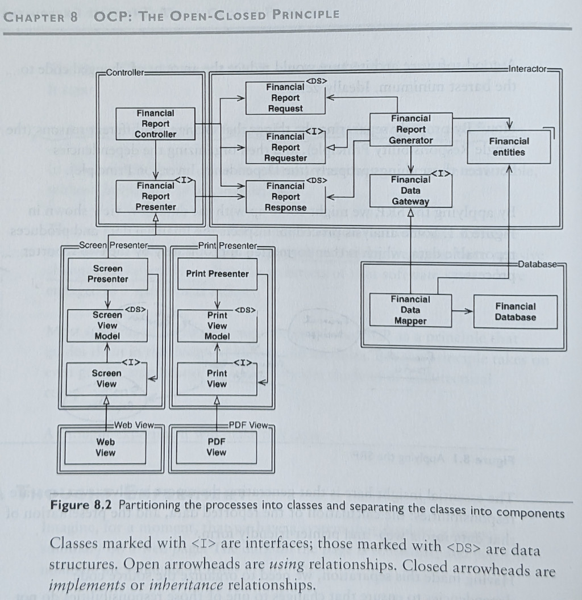
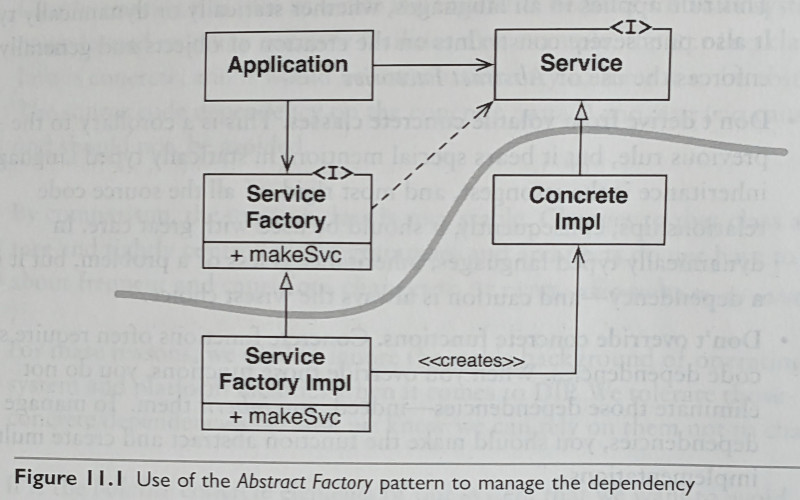

# Clean Architecture

- **url** = [livre sur le site de l'éditeur](https://www.pearson.com/en-us/subject-catalog/p/clean-architecture-a-craftsmans-guide-to-software-structure-and-design/P200000009528?view=educator)
- **type** = livre
- **auteur** = [Robert C. Martin a.k.a Uncle Bob](https://en.wikipedia.org/wiki/Robert_C._Martin) = architecte, co-auteur du manifeste agile, promoteur des principes SOLID
- **date de publication** = 2017-09-10
- **source** = N/A
- **tags** = language>agnostic ; topic>architecture ; level>intermediate

_WORK IN PROGRESS..._

Je n'annote pas tout exhaustivement (les présentes notes ne constituent donc PAS un résumé auto-porteur) : je me contente de ce qui a retenu mon attention / que j'estime nécessaire d'annoter.

Les numéros des pages font référence à mon édition = `ISBN-13: 978-0-13-449416-6`

* [Clean Architecture](#clean-architecture)
   * [Chapitre 2 = A Tale of Two Values](#chapitre-2--a-tale-of-two-values)
   * [Chapitre 4 = Structured programming](#chapitre-4--structured-programming)
   * [Chapitre 5 = Object-Oriented Programming](#chapitre-5--object-oriented-programming)
   * [Chapitre 6 = Functional Programming](#chapitre-6--functional-programming)
   * [Partie 3 = Design Principles](#partie-3--design-principles)
   * [Chapitre 8 = Open-Closed Principle](#chapitre-8--open-closed-principle)
   * [Chapitre 9 = Liskov-Substitution-Principle](#chapitre-9--liskov-substitution-principle)
   * [Chapitre 10 = Interface Segregation Principle](#chapitre-10--interface-segregation-principle)
   * [Chapitre 11 = The Dependency-Inversion Principle](#chapitre-11--the-dependency-inversion-principle)
   * [Chapitre 12 = Components](#chapitre-12--components)
   * [Chapitre 13 components cohésion](#chapitre-13-components-cohésion)

## Chapitre 2 = A Tale of Two Values

Deux propriétés souhaitées pour un soft :
- **Architecture** = easy to change
- **Behaviour** = works as intended

Son message = mieux vaut un software qui ne marche pas mais qui a une bonne architecture (= facile à modifier) plutôt que le contraire !

En effet, si on peut facilement changer un software qui ne marche pas, on pourra facilement le modifier afin de le faire marcher ; a contrario, même un software qui marche comme attendu est voué à l'échec à long-terme si on ne peut pas le modifier.

## Chapitre 4 = Structured programming

Ce qu'on veut, c'est avoir des programmes qu'on peut essayer de démontrer comme faux. Notre échec à les démontrer faux ne prouve certes pas qu'ils sont corrects, mais ils seront "good enough", ce qui nous convient.

Avoir des programmes qu'on peut prouver faux revient à avoir des programmes TESTABLES. Pour qu'un programme soit testable, il ne doit pas avoir de `goto`, car ils empêchent de prouver des trucs sur mes programmes.

## Chapitre 5 = Object-Oriented Programming

La caractéristique importante de l'OOP, c'est le polymorphisme = recevoir une interface plutôt qu'une implémentation concrète.

Le fait que les business rules dépendent d'une interface (plutôt que d'une implémentation concrète telle qu'une dB) permet un truc important = considérer que la dB lui sera injectée comme un plugin. Elle utilise un plugin (qui pourra au runtime être n'importe quoi), plutôt qu'une dB concrète.

## Chapitre 6 = Functional Programming

L'intérêt de l'immutabilité ? Plus aucune race condition ou deadlock ! Donc concurrence plus facile.

Chaque programming paradigm **restreint** ce qu'on peut faire :

- **structured programming** interdit de se téléporter arbitrairement à n'importe quel endroit du code : le flow d'exécution devient séquentiel
- **object oriented programming** "interdit" d'appeler une méthode concrète directement, en recommandant d'utiliser plutôt une interface
- **functional programming** interdit de muter des variables

## Partie 3 = Design Principles

Une bonne architecture et un clean code doivent aller ensemble :

- d'un côté le clean code est indispensable car il est inutile d'architecturer correctement une application si ses briques de bases sont pourries
- de l'autre une bonne archi reste indispensable même avec de bonnes briques, car on peut tout à fait construire un bazar horrible à partir de briques impeccables

## Chapitre 8 = Open-Closed Principle

Formulation intéressante : un composant A doit être **PROTÉGÉ** d'un autre composant B = on veut que A n'ait pas besoin de changer lorsque B change. Comment ? C'est B qui doit dépendre de A et pas le contraire.

**La bonne question à se poser pour concevoir une bonne architecture est : qui veut on protéger de qui ?**

Page 72, il donne un exemple d'application et son architecture :

Notations :

- flèche à pointe triangle creux = "la source implémente la target"
- flèche à pointe en V = "la source utilise la target"
- dans les deux cas, le composant source de la flèche DÉPEND du composant target

On veut protéger le `Controller` du `Presenter`. Pourquoi ? Car on veut pouvoir facilement ajouter de nouvelles façons de présenter les financial data (= ajouter un `Presenter`), sans modifier le reste de l'app (= le `Controller` ou l' `Interactor`).

À noter que deux composants de haut niveau sont candidats à être protégés de tous les autres : le `Controller` (= une sorte de main qui orchestre la création du rapport financier et sa présentation) et l' `Interactor` (= capable de générer des rapports financiers).

Lequel choisir ? Celui qui contient les business rules + les entities ! C'est donc l' `Interactor` qui doit être le mieux protégé.

NDM : ça va contre une (mauvaise !) intuition de ma part où je considère que c'est l'élément en haut du control-flow (donc le `main` / `Controller`) qui doit être en haut de la hiérarchie de composants... Il faut que je me méfie de cette mauvaise intuition... Et que j'en parle dans ma prez sur l'archi-hexagonale !

Autre point intéressant dans le contexte de ma prez sur l'archi hexagonale  : dans son exemple, ce que j'aurais mis en un seul adapter (= `PdfDisplayer`), il l'a splité en deux (un truc générique `PrintPresenter` = "afficheur-de-trucs-printés" et un truc plus particulier `PdfView`). C'est peut être une partie de la réponse à mes questionnements sur le fait qu'il peut y avoir beaucoup de code important hors de l'hexagone, dans les adapters, donc difficile à tester... En effet, en splittant tel qu'il le fait, le `PrintPresenter` n'interagit pas avec l'extérieur (l'I/O est plutôt dans `PdfView` : typiquement, c'est `PdfView` qui utiliserait une lib concrète de génération de PDF). Du coup, on peut unit-tester `PrintPresenter`, p.ex. le fait d'entourer les nombres négatifs avec des parenthèses plutôt que les mettre en rouge. Seul ce qui est dans `PdfView` = l'export PDF à proprement parler est dans un adapteur non-unit-testable. Dit autrement : le `PrintPresenter` fait partie de l'hexagone, lui aussi.

Citation intéressante :

> The goal is to make the system easy to extend without incurring a high impact of change. This goal is accomplished by partitioning the system into components, and arranging those components into a dependency hierarchy that protects higher-level components from changes in lower-level components.

## Chapitre 9 = Liskov-Substitution-Principle

Pas grand chose à annoter ici, si ce n'est que le terme **interface** (ou _parent type_) est à prendre au sens large ici = la forme de ce dont dépend un utilisateur :

- une classe virtuelle pure en C++
- des classes ayant les mêmes méthodes (duck-typing) en python
- une API REST

## Chapitre 10 = Interface Segregation Principle

Au sens large, ISP = viser à ne dépendre que de ce qu'on utilise.

Si besoin, "casser" une classe en plusieurs interfaces : une même classe implémente plusieurs interfaces. Chaque utilisateur d'une interface utilisera peut-être la même classe under-the-hood (= celle qui implémente plusieurs interfaces), mais ils ne dépendront plus de toute la classe, ils dépendront uniquement de l'interface vers le morceau qu'ils utilisent.

La bonne question à se poser pour identifier les dépendances = **si je modifie une classe A, quels modules dois-je recompiler ?**

## Chapitre 11 = The Dependency-Inversion Principle

On veut éviter de dépendre de ce qui varie : dépendre de choses stables, même concrètes, n'est pas un souci.

Pourquoi vaut-il mieux dépendre d'interfaces abstraites ? Parce qu'elles sont plus STABLES que les implémentations concrètes !

Si `[A] ---(utilise)--->  [I] ◁---(implémente)--- [B]`, alors on n'y coupera pas : un composant (en général le main), devra instancier un objet concret B (le main dépend donc de B ! il dépend de l'implémentation concrète !), et le passer à A sous forme de l'interface I (A ne dépend pas de B, mais de I, l'interface).

NDM : avec ma (mauvaise) compréhension intuitive que "app == main", j'avais du mal à comprendre comment l'app pouvait ne pas dépendre de la classe concrète B... J'avais donc du mal à comprendre un schéma comme celui du livre :

Les choses deviennent plus claire quand on comprend que l'app n'est PAS le main, mais est une simple classe instanciée par le main, et à laquelle le main passe les dépendances sous forme d'interface.

Dit autrement, en prenant l'exemple d'une `App` utilisant une `ConcreteDatabase` via une interface `IDataFetcher`, il y a une différence conceptuelle importante entre :

- **le flow of control** = l'ordre dans lequel on utilise les divers éléments :
    - le `main` est la première fonction à être appelée
    - elle connaît la classe concrète `ConcreteDatabase`, et l'utilise en l'instanciant
    - elle connaît l'interface `IDataFetcher`, et l'utilise en castant (conceptuellement) l'instance de `ConcreteDatabase` en l'interface `IDataFetcher`
    - elle connaît la classe concrète `App`, et l'utilise en l'instanciant en lui passant `ConcreteDatabase` déguisé en `IDataFetcher`
    - en résumé, dans le flow of control, `App` (et dans une moindre mesure `IDataFetcher`) "dépendent" de `ConcreteDatabase`, car on a besoin de connaître `ConcreteDatabase` pour utiliser `App` !
- **les source-code dependencies** = ce dont un code-source dépend :
    - le code-source de `App` ne dépend que de `IDataFetcher`, et ne connaît pas `ConcreteDatabase` ou le `main`
    - le code-source de `ConcreteDatabase` ne dépend que de `IDataFetcher`, et ne connaît pas `App` ou le `main`
    - le code-source de `IDataFetcher` ne dépend de personne !
    - (le code-source du `main` dépend de tout le monde = `App`, `ConcreteDatabase`, et `IDataFetcher`)

Les deux points qu'il est crucial de comprendre :

- l'app n'est pas le main
- ce sont les source-code dependencies qui sont importantes, pour maintenir ou étendre facilement l'application, et non le flow-of-control

Du coup on se fiche que dans le flow-of-control `App` dépende de `ConcreteDatabase` : ce qui nous intéresse, c'est que ce ne soit pas le cas du code-source de `App` !

C'est ce qu'exprime le mot INVERSION dans le DIP : les dépendances du code-source sont INVERSÉES par rapport aux dépendances du flow-of-control.

## Chapitre 12 = Components

Components = plus petite unité deployable : DLL, exécutable, etc.

Component plugin architecture = loader une DLL au runtime pour plugger un bout du programme dynamiquement ; au static-time, l'app ne sait pas ce qui lui sera pluggé ! (elle n'en dépend donc pas)

## Chapitre 13 components cohésion

Note préliminaire = le livre utilise beaucoup le terme de _release_, un bon modèle conceptuel est d'envisager ça en se mettant dans la peau du mainteneur d'une librairie ou d'un tool utilisé publiquement : la release est la livraison sur github d'une version de ce tool, avec son id semver, etc.

La question cruciale à se poser pour concevoir une bonne architecture = **Which classes belong to which component ?**

La partie difficile, c'est de choisir selon quels critères on regroupe des classes au sein d'un composant : il y a plusieurs types de "cohésion", qui sont en tension :

- REUSE/RELEASE EQUIVALENCE PRINCIPLE = les classes d'un composant doivent être releasable ensemble, elles doivent partager un thème commun
   - contre-exemple = si en sortant une nouvelle version du tool, ses utilisateurs disent "je n'utilise pas les modifs apportées par cette nouvelle release, je préfère rester à l'ancienne version"
- COMMON CLOSURE PRINCIPLE = c'est le Single-Responsibility Principle appliqué aux components = les classes d'un composant doivent avoir les mêmes raisons de changer
- COMMON REUSE PRINCIPLE = c'est l'Interface-Segregation Principle appliqué aux components = un utilisateur ne doit pas avoir à dépendre de classes d'un composant qu'il n'utilise pas

On aboutit forcément à un compromis, un équilibre car ces principes sont en opposition :

- le Common Reuse Principle encourage à **enlever** des trucs d'un composants (pour le splitter en plusieurs composants séparés)
- les deux autres principes encouragent à **ajouter** des trucs aux composants pour grouper entre elles des classes similaires

Note importante = le "bon" compromis n'est pas absolu, et peut évoluer avec la maturité du projet, p.ex. :

- au début du projet, on ne l'utilise qu'en standalone, on se fiche qu'il soit réutilisable, donc on mets plein de trucs dans un unique composant en se fichant d'un manque de cohésion (ou plus exactement on considère que sa cohésion est ok, vu que le projet utilise tout ce qu'il y a dans cet unique composant)
- quand le projet gagne en maturité, certains de ses morceaux commencent à être réutilisés par d'autres projets, donc on a tendance à mieux splitter les responsabilités, pour qu'elles soit utilisables par d'autres projets (plus exactement, le fait que le projet initial utilise toutes les classes ne veut plus dire que c'est la bonne façon de regrouper les classes)

REPRENDRE À = PAGE 111
