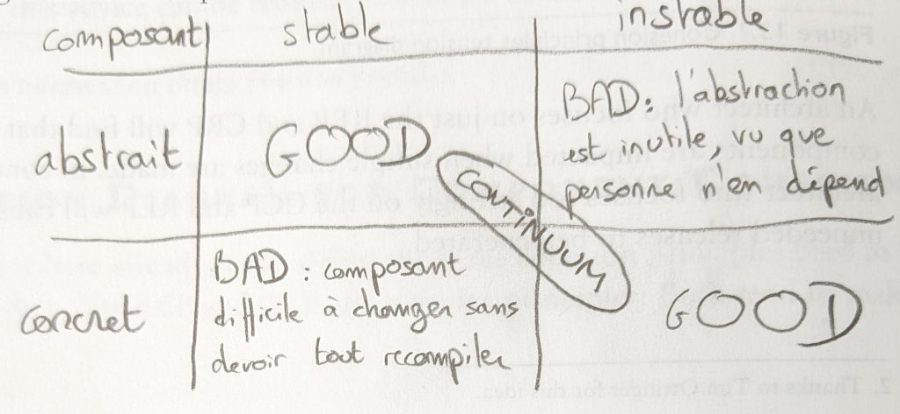

# Clean Architecture

- **url** = [livre sur le site de l'éditeur](https://www.pearson.com/en-us/subject-catalog/p/clean-architecture-a-craftsmans-guide-to-software-structure-and-design/P200000009528?view=educator)
- **type** = livre
- **auteur** = [Robert C. Martin a.k.a Uncle Bob](https://en.wikipedia.org/wiki/Robert_C._Martin) = architecte, co-auteur du manifeste agile, promoteur des principes SOLID
- **date de publication** = 2017-09-10
- **source** = N/A
- **tags** = language>agnostic ; topic>architecture ; level>intermediate

_WORK IN PROGRESS..._

Je n'annote pas tout exhaustivement (les présentes notes ne constituent donc PAS un résumé auto-porteur) : je me contente de ce qui a retenu mon attention / que j'estime nécessaire d'annoter.

Les numéros des pages font référence à mon édition = `ISBN-13: 978-0-13-449416-6`

* [Clean Architecture](#clean-architecture)
   * [Partie 1 = Introduction](#partie-1--introduction)
      * [Chapitre 2 = A Tale of Two Values](#chapitre-2--a-tale-of-two-values)
   * [Partie 2 = Starting With The Bricks : Programming Paradigms](#partie-2--starting-with-the-bricks--programming-paradigms)
      * [Chapitre 4 = Structured programming](#chapitre-4--structured-programming)
      * [Chapitre 5 = Object-Oriented Programming](#chapitre-5--object-oriented-programming)
      * [Chapitre 6 = Functional Programming](#chapitre-6--functional-programming)
   * [Partie 3 = Design Principles](#partie-3--design-principles)
      * [Chapitre 8 = Open-Closed Principle](#chapitre-8--open-closed-principle)
      * [Chapitre 9 = Liskov-Substitution-Principle](#chapitre-9--liskov-substitution-principle)
      * [Chapitre 10 = Interface Segregation Principle](#chapitre-10--interface-segregation-principle)
      * [Chapitre 11 = The Dependency-Inversion Principle](#chapitre-11--the-dependency-inversion-principle)
   * [Partie 4 = Component Principles](#partie-4--component-principles)
      * [Chapitre 12 = Components](#chapitre-12--components)
      * [Chapitre 13 = Components Cohesion](#chapitre-13--components-cohesion)
      * [Chapitre 14 = Component Coupling](#chapitre-14--component-coupling)
   * [Partie 5 = Architecture](#partie-5--architecture)
      * [Chapitre 15 = what is architecture](#chapitre-15--what-is-architecture)
      * [Chapitre 16 = Independance](#chapitre-16--independance)
      * [Chapitre 17 = Boundaries : Drawing Lines](#chapitre-17--boundaries--drawing-lines)
      * [Chapitre 18 = Boundary Anatomy](#chapitre-18--boundary-anatomy)
      * [Chapitre 19 : Policy And Level](#chapitre-19--policy-and-level)
      * [Chapitre 20 = Business Rules](#chapitre-20--business-rules)
      * [Chapitre 21 = Screaming Architecture](#chapitre-21--screaming-architecture)
      * [Chapitre 22 : the Clean Architecture](#chapitre-22--the-clean-architecture)
      * [Chapitre 23 = Presenters And Humble Objects](#chapitre-23--presenters-and-humble-objects)
      * [Chapitre 24 = Partial Boundaries](#chapitre-24--partial-boundaries)
      * [Chapitre 25 = Layers And Boundaries](#chapitre-25--layers-and-boundaries)
      * [Chapitre 26 = The Main Component](#chapitre-26--the-main-component)
      * [Chapitre 27 = Services, Great And Small](#chapitre-27--services-great-and-small)
      * [Chapitre 28 = The Test Boundary](#chapitre-28--the-test-boundary)
      * [Chapitre 29 = Clean Embedded Architecture](#chapitre-29--clean-embedded-architecture)
   * [Partie 6 = Details](#partie-6--details)
      * [Chapitre 30 = The Database Is A Detail](#chapitre-30--the-database-is-a-detail)
   * [Notes supplémentaires](#notes-supplémentaires)

## Partie 1 = Introduction

### Chapitre 2 = A Tale of Two Values

Deux propriétés souhaitées pour un soft :
- **Architecture** = easy to change
- **Behaviour** = works as intended

Son message = mieux vaut un software qui ne marche pas mais qui a une bonne architecture (= facile à modifier) plutôt que le contraire !

En effet, si on peut facilement changer un software qui ne marche pas, on pourra facilement le modifier afin de le faire marcher ; a contrario, même un software qui marche comme attendu est voué à l'échec à long-terme si on ne peut pas le modifier.

## Partie 2 = Starting With The Bricks : Programming Paradigms

### Chapitre 4 = Structured programming

Ce qu'on veut, c'est avoir des programmes qu'on peut essayer de démontrer comme faux. Notre échec à les démontrer faux ne prouve certes pas qu'ils sont corrects, mais ils seront "good enough", ce qui nous convient.

Avoir des programmes qu'on peut prouver faux revient à avoir des programmes TESTABLES. Pour qu'un programme soit testable, il ne doit pas avoir de `goto`, car ils empêchent de prouver des trucs sur mes programmes.

### Chapitre 5 = Object-Oriented Programming

La caractéristique importante de l'OOP, c'est le polymorphisme = recevoir une interface plutôt qu'une implémentation concrète.

Le fait que les business-rules dépendent d'une interface (plutôt que d'une implémentation concrète telle qu'une dB) permet un truc important = considérer que la dB lui sera injectée comme un plugin. Elle utilise un plugin (qui pourra au runtime être n'importe quoi), plutôt qu'une dB concrète.

### Chapitre 6 = Functional Programming

L'intérêt de l'immutabilité ? Plus aucune race condition ou deadlock ! Donc concurrence plus facile.

Chaque programming paradigm **restreint** ce qu'on peut faire :

- **structured programming** interdit de se téléporter arbitrairement à n'importe quel endroit du code : le flow d'exécution devient séquentiel
- **object oriented programming** "interdit" d'appeler une méthode concrète directement, en recommandant d'utiliser plutôt une interface
- **functional programming** interdit de muter des variables

## Partie 3 = Design Principles

Une bonne architecture et un clean code doivent aller ensemble :

- d'un côté le clean code est indispensable car il est inutile d'architecturer correctement une application si ses briques de bases sont pourries
- de l'autre une bonne archi reste indispensable même avec de bonnes briques, car on peut tout à fait construire un bazar horrible à partir de briques impeccables

### Chapitre 8 = Open-Closed Principle

Formulation intéressante : un composant A doit être **PROTÉGÉ** d'un autre composant B = on veut que A n'ait pas besoin de changer lorsque B change. Comment ? C'est B qui doit dépendre de A et pas le contraire.

**La bonne question à se poser pour concevoir une bonne architecture est : qui veut on protéger de qui ?**

Page 72, il donne un exemple d'application et son architecture :

Notations :

- flèche à pointe triangle creux = "la source implémente la target"
- flèche à pointe en V = "la source utilise la target"
- dans les deux cas, le composant source de la flèche DÉPEND du composant target

On veut protéger le `Controller` du `Presenter`. Pourquoi ? Car on veut pouvoir facilement ajouter de nouvelles façons de présenter les financial data (= ajouter un `Presenter`), sans modifier le reste de l'app (= le `Controller` ou l' `Interactor`).

À noter que deux composants de haut-niveau sont candidats à être protégés de tous les autres : le `Controller` (= une sorte de main qui orchestre la création du rapport financier et sa présentation) et l' `Interactor` (= capable de générer des rapports financiers).

Lequel choisir ? Celui qui contient les business-rules + les entities ! C'est donc l' `Interactor` qui doit être le mieux protégé.

NDM : ça va contre une (mauvaise !) intuition de ma part où je considère que c'est l'élément en haut du control-flow (donc le `main` / `Controller`) qui doit être en haut de la hiérarchie de composants... Il faut que je me méfie de cette mauvaise intuition... Et que j'en parle dans ma prez sur l'archi-hexagonale !

Autre point intéressant dans le contexte de ma prez sur l'archi hexagonale  : dans son exemple, ce que j'aurais mis en un seul adapter (= `PdfDisplayer`), il l'a splité en deux (un truc générique `PrintPresenter` = "afficheur-de-trucs-printés" et un truc plus particulier `PdfView`). C'est peut être une partie de la réponse à mes questionnements sur le fait qu'il peut y avoir beaucoup de code important hors de l'hexagone, dans les adapters, donc difficile à tester... En effet, en splittant tel qu'il le fait, le `PrintPresenter` n'interagit pas avec l'extérieur (l'I/O est plutôt dans `PdfView` : typiquement, c'est `PdfView` qui utiliserait une lib concrète de génération de PDF). Du coup, on peut unit-tester `PrintPresenter`, p.ex. le fait d'entourer les nombres négatifs avec des parenthèses plutôt que les mettre en rouge. Seul ce qui est dans `PdfView` = l'export PDF à proprement parler est dans un adapteur non-unit-testable. Dit autrement : le `PrintPresenter` fait partie de l'hexagone, lui aussi.

Citation intéressante :

> The goal is to make the system easy to extend without incurring a high impact of change. This goal is accomplished by partitioning the system into components, and arranging those components into a dependency hierarchy that protects higher-level components from changes in lower-level components.

### Chapitre 9 = Liskov-Substitution-Principle

Pas grand chose à annoter ici, si ce n'est que le terme **interface** (ou _parent type_) est à prendre au sens large ici = la forme de ce dont dépend un utilisateur :

- une classe virtuelle pure en C++
- des classes ayant les mêmes méthodes (duck-typing) en python
- une API REST

### Chapitre 10 = Interface Segregation Principle

Au sens large, ISP = viser à ne dépendre que de ce qu'on utilise.

Si besoin, "casser" une classe en plusieurs interfaces : une même classe implémente plusieurs interfaces. Chaque utilisateur d'une interface utilisera peut-être la même classe under-the-hood (= celle qui implémente plusieurs interfaces), mais ils ne dépendront plus de toute la classe, ils dépendront uniquement de l'interface vers le morceau qu'ils utilisent.

La bonne question à se poser pour identifier les dépendances = **si je modifie une classe A, quels modules dois-je recompiler ?**

### Chapitre 11 = The Dependency-Inversion Principle

On veut éviter de dépendre de ce qui varie : dépendre de choses stables, même concrètes, n'est pas un souci.

Pourquoi vaut-il mieux dépendre d'interfaces abstraites ? Parce qu'elles sont plus STABLES que les implémentations concrètes !

Si `[A] ---(utilise)--->  [I] ◁---(implémente)--- [B]`, alors on n'y coupera pas : un composant (en général le main), devra instancier un objet concret B (le main dépend donc de B ! il dépend de l'implémentation concrète !), et le passer à A sous forme de l'interface I (A ne dépend pas de B, mais de I, l'interface).

NDM : avec ma (mauvaise) compréhension intuitive que "app == main", j'avais du mal à comprendre comment l'app pouvait ne pas dépendre de la classe concrète B... J'avais donc du mal à comprendre un schéma comme celui du livre :

Les choses deviennent plus claire quand on comprend que l'app n'est PAS le main, mais est une simple classe instanciée par le main, et à laquelle le main passe les dépendances sous forme d'interface.

Dit autrement, en prenant l'exemple d'une `App` utilisant une `ConcreteDatabase` via une interface `IDataFetcher`, il y a une différence conceptuelle importante entre :

- **le flow of control** = l'ordre dans lequel on utilise les divers éléments :
    - le `main` est la première fonction à être appelée
    - elle connaît la classe concrète `ConcreteDatabase`, et l'utilise en l'instanciant
    - elle connaît l'interface `IDataFetcher`, et l'utilise en castant (conceptuellement) l'instance de `ConcreteDatabase` en l'interface `IDataFetcher`
    - elle connaît la classe concrète `App`, et l'utilise en l'instanciant en lui passant `ConcreteDatabase` déguisé en `IDataFetcher`
    - en résumé, dans le flow of control, `App` (et dans une moindre mesure `IDataFetcher`) "dépendent" de `ConcreteDatabase`, car on a besoin de connaître `ConcreteDatabase` pour utiliser `App` !
- **les source-code dependencies** = ce dont un code-source dépend :
    - le code-source de `App` ne dépend que de `IDataFetcher`, et ne connaît pas `ConcreteDatabase` ou le `main`
    - le code-source de `ConcreteDatabase` ne dépend que de `IDataFetcher`, et ne connaît pas `App` ou le `main`
    - le code-source de `IDataFetcher` ne dépend de personne !
    - (le code-source du `main` dépend de tout le monde = `App`, `ConcreteDatabase`, et `IDataFetcher`)

Les deux points qu'il est crucial de comprendre :

- l'app n'est pas le main
- ce sont les source-code dependencies qui sont importantes, pour maintenir ou étendre facilement l'application, et non le flow-of-control

Du coup on se fiche que dans le flow-of-control `App` dépende de `ConcreteDatabase` : ce qui nous intéresse, c'est que ce ne soit pas le cas du code-source de `App` !

C'est ce qu'exprime le mot INVERSION dans le DIP : les dépendances du code-source sont INVERSÉES par rapport aux dépendances du flow-of-control.

## Partie 4 = Component Principles

### Chapitre 12 = Components

Components = plus petite unité deployable : DLL, exécutable, etc.

Component plugin architecture = loader une DLL au runtime pour plugger un bout du programme dynamiquement ; au static-time, l'app ne sait pas ce qui lui sera pluggé ! (elle n'en dépend donc pas)

### Chapitre 13 = Components Cohesion

Note préliminaire = le livre utilise beaucoup le terme de _release_, un bon modèle conceptuel est d'envisager ça en se mettant dans la peau du mainteneur d'une librairie ou d'un tool utilisé publiquement : la release est la livraison sur github d'une version de ce tool, avec son id semver, etc.

La question cruciale à se poser pour concevoir une bonne architecture = **Which classes belong to which component ?**

La partie difficile, c'est de choisir selon quels critères on regroupe des classes au sein d'un composant : il y a plusieurs types de "cohésion", qui sont en tension :

- REUSE/RELEASE EQUIVALENCE PRINCIPLE = les classes d'un composant doivent être releasable ensemble, elles doivent partager un thème commun
   - contre-exemple = si en sortant une nouvelle version du tool, ses utilisateurs disent "je n'utilise pas les modifs apportées par cette nouvelle release, je préfère rester à l'ancienne version"
- COMMON CLOSURE PRINCIPLE = c'est le Single-Responsibility Principle appliqué aux components = les classes d'un composant doivent avoir les mêmes raisons de changer
- COMMON REUSE PRINCIPLE = c'est l'Interface-Segregation Principle appliqué aux components = un utilisateur ne doit pas avoir à dépendre de classes d'un composant qu'il n'utilise pas

On aboutit forcément à un compromis, un équilibre car ces principes sont en opposition :

- le Common Reuse Principle encourage à **enlever** des trucs d'un composants (pour le splitter en plusieurs composants séparés)
- les deux autres principes encouragent à **ajouter** des trucs aux composants pour grouper entre elles des classes similaires

Note importante = le "bon" compromis n'est pas absolu, et peut évoluer avec la maturité du projet, p.ex. :

- au début du projet, on ne l'utilise qu'en standalone, on se fiche qu'il soit réutilisable, donc on mets plein de trucs dans un unique composant en se fichant d'un manque de cohésion (ou plus exactement on considère que sa cohésion est ok, vu que le projet utilise tout ce qu'il y a dans cet unique composant)
- quand le projet gagne en maturité, certains de ses morceaux commencent à être réutilisés par d'autres projets, donc on a tendance à mieux splitter les responsabilités, pour qu'elles soit utilisables par d'autres projets (plus exactement, le fait que le projet initial utilise toutes les classes ne veut plus dire que c'est la bonne façon de regrouper les classes)

### Chapitre 14 = Component Coupling

Globalement l'exemple illustratif pages 114 à 118 et les explications qui l'accompagnent sont très bien.

Notamment, le schéma page 117 explique comment appliquer le DIP pour inverser une dépendance = au lieu que A se mette à dépendre de B, on crée une interface dans A qui représente ce dont A a besoin, et B implémente cette interface.

Notamment (bis), le schéma page 118 explique très bien comment le fait de créer un nouveau composant aide à garder les flèches des dépendances dans le bon sens = le nouveau composant est placé au plus bas, et aussi bien A que B en dépendent.

On dispose donc de deux outils pour casser des dépendances qui vont dans le mauvais sens :

- DIP
- créer un nouveau composant

Attention : la structure de composants évolue au fur et à mesure de la vie du projet ! Plus important (et de façon contre-intuitive), la structure de composants n'est pas dictée par ce que fait le projet (i.e. ce n'est pas un découpage fonctionnel) mais elle est dictée par comment il doit être buildé/maintenu.

> we don't want cosmetic changes to the GUI to have an impact on our business-rules
>
> the component dependency graph is created and molded by architects to protect stable high-value components from volatile comopnents

Dans le chapitre, il définit les notions :

- en gros, un composant peut avoir des raisons de changer (= il dépend de qqun) et des raisons de ne pas changer (= qqun dépend de lui)
- instabilité s'il a beaucoup de raisons de changer et peu de raisons de ne pas changer
- stabilité si beaucoup de raisons de ne pas changer (des composants dépendent de lui) + peu de raisons de changer (il dépend de peu de composants)
- volatilité = probabilité qu'un composant change

À noter que c'est NORMAL que certains composants soient instables et doivent beaucoup être modifiés : il est impossible que tout le système soit figé !

Stable Dependencies Principle  = les composants instables doivent dépendre des composants stables et pas le contraire.

Stable Abstraction Principle = plus un composant est stable (tout le monde en dépend), plus il devrait être abstrait.

Tout ceci est illustré par un diagramme :

## Partie 5 = Architecture

### Chapitre 15 = what is architecture

Une bonne archi n'est pas là pour qu'un système FONCTIONNE : plein de systèmes mal architecturés fonctionnent très bien ! Une bonne archi rend un système plus facile à :

- déployer
- maintenir
- développer plus avant

Attention : une mauvaise archi peut faciliter le développement, mais compliquer le déploiement.

La phase de maintenance est la plus coûteuse, notamment à cause du temps passé à chercher où intégrer les nouvelles features sans tout casser.

On veut :

- figer ce qui est stratégique (policies)
- retarder les décisions sur ce qui ne l'est pas (details)

Objectif = the policy does not depend on the details in any way.

Une bonne/mauvaise archi impacte :
- Development
- Deployment
- Maintenance
- Operation (dans une moindre mesure, car les impacts de l'archi sur les opérations sont moins coûteux que sur les trois points précédents ; en effet, les opérations coûtent du hardware, alors que les 3 points précédents coûtent du temps humain, ce qui est beaucoup plus cher)
- Caractère compréhensible de l'app = l'archi indique les besoins opérationnels de l'app.

> The architecture of the system should elevate the use-cases, the features, and the required behaviors of the system to first-class entities that are visible landmarks for the developers. This simplifies the understanding of the system and, therefore, greatly aids in development and maintenance.

Policy (ce qui compte) vs détails (nécessaire, mais avec peu de valeur ajoutée : IO, database, framework, etc.).

On veut garder nos options ouvertes pour les détails → on ne veut pas se marier avec.

L'architecture doit retarder le choix de ces détails, et rendre facile leur remplacements par d'autres choix. À ce sujet, les exemples de la page 141 sont bien illustratifs.

(Bonus = plus on a retardé ces choix, plus on a d'informations à notre disposition pour prendre une décision éclairée au moment où on finit par le faire).

Pages 142 et 143 : intéressant parallèle entre une bonne architecture (qui abstrait les détails : l'app ne les connaît pas) et un programme qui tourne sur un os (le programme ne connaît pas les détails de comment afficher un caractère sur ce hardware particulier).

Page 145 : la policy, c'est d'imprimer et de formater les lettres. Les détails, c'est le device utilisé : printer ou magnetic tape.

Conclusion : la policy ne doit pas avoir connaissance des détails.

### Chapitre 16 = Independance

Objectif 1 de l'archi = supporter les use-cases. Plus exactement, une mauvaise archi n'empêchera pas les use-cases de fonctionner, mais une bonne archi rendra visibles les use-cases (et évitera au dev de servir faire de l'archéologie pour les retrouver), cf. "screaming architecture".

Objectif 2 = permettre d'opérer le système. Autant que possible, l'architecture ne doit pas se marier avec un choix concret (tel que monolithe, microservice, multithread, multiprocess) mais plutôt être agnostique sur le sujet. (Ndm : je pense que c'est comme ça qu'il faut interpréter les phrases du genre "l'archi doit supporter les contraintes de perfs opérationnelles" : l'archi doit être capable d'opérer dans le mode qui sera nécessaire pour avoir de bonnes perfs, p.ex. en multithreadé)

Objectif 3 = l'archi joue un rôle important pour faciliter le dev. Exemple, l'App peut être découpée en plusieurs composants indépendants, developpables par plusieurs équipes indépendantes.

Objectif 4 = l'archi joue également un rôle important pour faciliter le déploiement.

Au final, on veut équilibrer tout ça, et c'est pas facile, d'autant que toutes les contraintes 1. ne sont pas connues et 2. évoluent.

Notre outil = découpler les morceaux du système qui vont avoir des raisons différentes de changer. Et possiblement, pousser le découplage jusqu'à en faire des services différents.

Il y a une section intéressante sur la duplication : la vraie duplication, c'est quand toute modif faite à gauche devra être refaite à droite.

MAIS tout code dupliqué n'est pas forcément de la vraie duplication ! Parfois, même si le code est dupliqué, les deux composants évoluent chacun à leur rythme, et si on revenait les consulter plus tard après quelques mois, ils auraient évolué de sorte que la duplication n'existerait plus (preuve que ce n'en était pas une vraie). C'est souvent le cas avec les use-cases ; son conseil = résister à mutualiser des trucs dans les use-cases.

La dernière section du chapitre est intéressante aussi : il mentionne trois niveaux auxquels découpler des composants :
- Source code = si un composant A change, alors B n'a pas à être recompilé (ndm : mais les deux composants sont tout de même déployés ensemble, comme un monolithe)
- Déploiement = on peut déployer A indépendamment de B, p.ex. sous forme d'une shared-lib, soit au sein d'un même process ayant un unique adresse-space (les composants peuvent communiquer par appel de fonction), soit comme des process différents communiquant par IPC.
- Service = les composants sont des services différents, tournant possiblement sur des machines différentes, et communiquent par message sur le réseau.

Une bonne archi permet de passer sans douleur d'un mode de découplage à l'autre. (Ndm : c'est assez théorique...)

### Chapitre 17 = Boundaries : Drawing Lines

Les trucs importants = les business-rules / use-cases.

Les trucs pas importants = le reste, notamment les interactions avec le monde extérieur.

Une bonne archi permet de ne choisir les trucs pas importants qu'au dernier moment.

Il donne un retour d'expérience intéressant, où DÈS LE DÉBUT DU PROJET, il masque l'implémentation de sa persistance de données derrière une interface :

- dès le début, il a en tête l'idée d'utiliser à terme MySQL
- mais pour développer rapidement, il commence par implémente son interface avec un mock
- puis, quand le mock devient limitant, il implémente une in-memory database
- puis, quand ça devient limitant, un filesystem-storage
- et au final, il se rend compte qu'il n'a jamais besoin d'aller plus loin et d'utiliser MySQL !

Deux points importants : il a tracé une boundary-line dès le début entre les business-rules et la database ; et du coup il s'est économisé PLEIN de problèmes liés à l'utilisation d'une database.

Schéma page 167 : la database interface "fait partie de l'App" (elle est du côté de l'App, pas de la database)

Schéma page 168 : une incompréhension à ne pas faire :

- quand on dit "la database dépend de l'App"...
- ... ça ne veut pas vraiment dire que le code de l'accès à la database a besoin des business-rules pour fonctionner !
- ça veut plutôt dire que ce code implémente une interface (représentant l'accès à la databse), et cette interface fait partie de l'app

Page 169 : j'aime beaucoup son exemple du jeu vidéo : même si notre expérience de joueur est dominée par l'UI, le jeu lui même est surtout un modèle, qui a une existence indépendante de l'UI ! (NDM : si je veux faire un jeu d'échecs, ce qui constitue le cœur de métier du jeu, c'est les pièces, l'échiquier, les règles, l'IA ... et pas l'UI)

Ndm : pour apporter de l'eau à mon moulin de "une partie significative de la valeur ajoutée de l'App peut se trouver dans les adapters" : un design et une UX très travaillés peuvent être le différenciant principal par rapport aux concurrents (e.g. d'un jeu d'échecs à l'UX futuriste), et cette valeur ajoutée sera (au moins en partie) dans l'UI plutôt que dans "l'app".

> We want certain modules to be immune to others. For example, we don't want the business-rules to break when someone changes the format of a web page, or changes the schema of the database.

Le takeaway = mettre une frontière quand les composants changent pour des raisons ou à une fréquence différentes.

### Chapitre 18 = Boundary Anatomy

Cf. ses schémas pages 177 et 178 : quand un client appelle une fonction `f` derrière une boundary, on a deux cas :

- le client est low-level, `f` est high-level. Dans ce cas, la dépendance va dans le même sens que le flow of control (à noter que la structure de données échangée est définie dans le composant high-level)
- le client est high-level, `f` est low-level. Dans ce cas, la dépendance ira à rebours du flow of control : le client appelle une interface (du même côté de la boundary que lui), et `f` implémente cette interface. (et ici aussi la structure de données échangée est définie dans le composant high-level)

Il mentionne de nouveau plusieurs niveaux de découplage, par ordre :

- Source-level = le découplage auquel je suis habitué (l'interface est p.ex. une classe virtuelle pure)
- Ce qu'il appelle deployment-level = les composants sont des DLL d'un même exe, l'interface est binaire
- (dans les deux cas précédents, les composants communiquent par simple appel de fonction au sein d'un même address-space)
- Local-process = deux composants sont des process différents de la même machine, qui communiquent par réseau, IPC, message-queue, ou autre (donc plus coûteux que des appels de fonction)
- Service : toutes les communications passent par le réseau (donc lentes), les services peuvent être sur des machines différentes. Même dans ce cas, les règles doivent quand même être respectées : les low-level services doivent être des plugins des high-level services, qui ne doivent jamais avoir connaissance d'aucun détail (e.g. une IP) des low-level sercice.

On peut mixer plusieurs niveaux.

> A service is often just a facade for a set of interacting local processes

À noter : les threads ne sont pas des découpages architecturaux, mais juste des moyens d'organiser le travail à faire.

### Chapitre 19 : Policy And Level

Chapitre court, mais abordant ou rappelant des notions très importantes !

> A computer program is a detailed description of the policy by which inputs are transformed into outputs.

Page 184, il donne trois exemples de policies, qui sont intéressants, car à des niveaux différents :

- Calculer une règle métier (cette policy est loin des I/O)
- Choisir comment formater un rapport (cette policy est proche de l'Output)
- Savoir comment valider un input (cette policy est proche de l'Input)

On regroupe les policies en composants, selon la façon dont elles évoluent : deux policies qui évoluent en même temps iront ensemble, deux policies qui évoluent à des rythmes différents et pour des raisons différentes iront dans deux composants séparés.

On vise à ce que les dépendances entre les composants forment un DAG. (Note qu'on parle toujours des source-code dependencies ; l'objectif est que les composants bas-niveau dépendent des composants haut-niveau, et non l'inverse).

**Définition de ce qui est bas-niveau vs. haut-niveau** :

- bas-niveau = proche des entrées/sorties
- haut-niveau = loin des entrées/sorties

On veut que les source-code dependencies soient couplées au niveau, et non au control-flow !

Une formulation très parlante : du point de vue des composants hau-niveau, les composants bas-niveau doivent être des plugins interchangeables.

### Chapitre 20 = Business Rules

Ici aussi, des notions importantes rappelées/abordées en peu de pages.

**Définition des business-rules** = ce qui fait gagner ou économiser de l'argent à l'entreprise

Certaines sont même indépendantes de l'App (et pourraient par exemple être réutilisées, inchangées, dans une autre app si elle concerne le même domaine), on les appelle **Entities** ; elles peuvent être des data ou des fonctions.

Une business-rules qui décrit la façon dont on utilise l'App est un peu moins généralisable (puisqu'elle est propre à l'App = elle n'existerait pas dans une autre app du même domaine), c'est le **Use-Case**. Il décrit l'input attendu, et l'output fourni en retour, et décrit comment l'App utilise les Entities pour faire son métier.

Attention, les use-cases ne décrivent PAS l'user-interface !

Les Entities ne connaissent pas les use-cases.

Note importante : les data structures utilisées par les use-cases en input ou output :

- ne doivent pas dépendre de considération bas-niveau  (e.g. d'une lib http) sinon les use-cases se mettent à dépendre d'un truc bas-niveau au lieu d'en être agnostiques
- ne doivent pas dépendre des entities (même si c'est très tentant car ce sont les mêmes données qui sont véhiculées) car les entities et les données d'entrée/sortie des use-cases évoluent pour des raisons différentes et à des rythmes différents (NDM : c'est le premier point du livre face auquel je suis un peu dubitatif : même si c'est mieux que le use-cases attende une requête agnostique, est-ce si grave si le client doit instancier une Entity pour appeler un use-case ?)

### Chapitre 21 = Screaming Architecture

Quand on regarde le package de haut-niveau, ou bien le répertoire de plus haut-niveau des sources, l'architecture doit CRIER le métier de l'App ("this app is an accounting-system") et non le framework utilisé ("this app uses the Rails framework").

Pour cela, l'architecture doit crier les use-cases de l'App.

L'archi ne doit pas se maquer avec un framework.

Note : le web fait partie des détails/framework : le web n'est qu'un I/O device, et notre app, même web, ne doit pas savoir qu'elle est délivrée sur le web : on devrait pouvoir la délivrer par un autre moyen sans que l'App ne change (NDM : c'est ce que j'ai fait dans ma prez sur le viewer).

Il faut protéger l'archi du framework ; on doit pouvoir unit-tester l'App sans avoir besoin du framework.

### Chapitre 22 : the Clean Architecture

Archi hexagonale, clean Architecture (et d'autres que je ne connais pas) ont tous des points communs = isoler l'appli du monde extérieur.

Son célèbre schéma page 203 résume ce que le livre a dit jusqu'ici :

Les points importants de ce schéma :

- les différentes couches sont de plus en plus haut-niveau au fur et à mesure qu'on va vers le centre
- le bas-niveau dépend du haut-niveau, ce qui se traduit par le fait que les flêches des dépendances pointent vers le centre
- le sous-schéma en bas à droite illustre le DIP :
    - le flow-of-control passe du controller à l'interactor puis au presenter
    - pourtant, les source-code dependencies pointent toutes vers l'interactor (qui ne connaît ni le presenter, ni le controller)

Dans ce chapitre, il y a beaucoup de redite et synthèse de ce qui a déjà été dit. Et c'est assez général sur le bouquin : une fois qu'on a compris ce qu'il voulait dire et mettre en avant, le livre répète souvent la même chose d'une façon légèrement différente (il gagnerait à être un peu plus condensé).

Les data structures échangées entre les layers doivent être simples, et ne pas dépendre des layers internes.

Il donne un exemple "concret" (ça reste assez abstrait...) Page 208.

Notamment, c'est intéressant de souligner la différence entre la donnée de sortie du use-case (= un objet `Datetime`, ou un object `Currency`) et la donnée manipulée par la couche suivante à savoir la view (= une string représentant cette date ou une string représentant les sous) !

Par contre, je ne peux pas m'empêcher de penser qu'il y a BEAUCOUP de conversions de données... En fonction de l'app, ça peut ou pas être problématique (et de toutes façons, il ne faut pas optimiser trop tôt), mais c'est un fait.

### Chapitre 23 = Presenters And Humble Objects

Humble-object pattern = splitter une classe difficile à tester en deux :

- une partie testable qui contient la majorité de la classe
- une partie plus petite (humble) qui ne contient que la partie difficile à tester

Exemple d'une GUI qui doit afficher une date : le présenter reçoit un objet `Date`, et le convertit en string, il est facilement testable. La view (humble object, difficilement testable, car c'est pas facile de tester ce qui s'affiche à l'écran) n'est plus en charge que de peu de choses = se contenter d'afficher la string.

> Testability is an attribute of good architectures

Selon lui, tous les adapters (notamment database + service) devraient être des humble objects.

### Chapitre 24 = Partial Boundaries

(ce chapitre et le suivant se frottent à la vraie vie, et s'intéressent à la différence entre théorie et pratique)

C'est assez coûteux de développer et maintenir une architecture propre : on a beaucoup d'interfaces et de boundaries à avoir, sans parler du fait qu'on doive déployer des composants indépendamment...

Pistes = ne faire le travail que partiellement :

- préparer les séparations de composants en créant les interfaces, mais sans réellement séparer les composants
- se contenter de faire une façade plutôt que de séparer en composants
- ...

Danger si on ne fait le travail que partiellement = seule la vigilance des devs empêche de créer de nouveau des dépendances dans le mauvais sens.

### Chapitre 25 = Layers And Boundaries

Dans ce chapitre, il montre qu'il peut y avoir plus de composants que simplement la classique triade { UI + business-rules + database }

Le boulot de l'architecte, c'est d'identifier ces boundaries...

...MAIS c'est pas aussi simple que ça : ça coûte cher de mettre des boundaries partout où on les identifie ! Faut-il le faire systématiquement ?

On a donc deux forces opposées, chacune nous poussant dans un sens différent :

- mettre des boundaries là où on les identifie comme nécessaires pour gagner les bénéfices apportés par une bonne archi
- ne pas mettre de boundaries, pour ne pas payer un coût architectural dont on n'aura pas besoin (yagni)

Le boulot de l'architecte, c'est de faire cet arbitrage. Et histoire de compliquer les choses, cet arbitrage n'est pas fixe, mais évolue régulièrement avec le projet :

> You weigh the costs of implementing those boundaries versus the cost of ignoring them — and you review that decision frequently. Your goal is to implement the boundaries right at the inflection point where the cost of implementing becomes less than the cost of ignoring.

Toute la conclusion de ce chapitre est intéressante et bonne à lire régulièrement.

### Chapitre 26 = The Main Component

Le main = le composant qui crée et coordonne tous les autres, il est le plus bas-niveau : il dépend de tout le monde.

Le main doit être un plugin pour l'application ; il est chargé de rassembler tout le monde, et toutes les configs et de transférer le contrôle à un composant de haut-niveau.

On peut avoir plusieurs mains pour l'application (e.g. un pour la config de dev, un autre pour la config de prod)

### Chapitre 27 = Services, Great And Small

L'architecture, c'est séparer les composants haut-niveau des composants bas-niveau (si on ne suit pas ce principe, utiliser des micro services n'est pas une architecture, c'est juste un appel de fonction un peu coûteux).

Idées fausses sur les microservices :
- Découplés, et avec une interface claire ? En vrai, pas tant que ça : ils restent couplés par les data qu'ils échangent. De plus, l'interface claire est certes vraie, mais c'est le cas aussi de n'importe quelle fonction.
- Developpables et deployables indépendamment ? D'abord, pas besoin des micro services pour ça ; et de plus, ça n'est pas entièrement vrai : à cause du couplage des services entre eux par leurs données

Pages 242 et 243, il donne un exemple concret d'application découpé en micro-services, mais qui n'est pour autant pas developpable et déployable indépendamment. Il donne un meilleur découpage (meilleur car plus extensible) page 244.

Son message = il ne faut pas utiliser les services comme un moyen de découper l'App : la structure interne de chaque service doit être aussi être découpée en composants correctement architecturés, selon les boundaries souhaités. Dit autrement, les micro services ne sont pas un moyen d'architecturer son application.

### Chapitre 28 = The Test Boundary

Les tests font partie du système. Ils dépendent de tout le monde et personne ne dépend d'eux (à tel point qu'ils ne sont même pas déployés en prod).

_Fragile Test Problem_ = le test est tellement couplé à la façon dont les choses sont implémentées qu'il casse dès qu'on change quelque chose dans l'implémentation. Par exemple, un test qui passe par l'UI pour tester les business-rules cassera dès que l'UI changera.

Paradoxalement, de nombreux tests, s'ils sont fragiles, ça a tendance à décourager les évolutions !

Solution = concevoir le système pour que les business-rules puissent être testés sans l'UI (car comme l'UI est volatile, il ne faut pas en dépendre).

Comment ? En créant une API spécialement conçue pour tester l'App. Cette API permet d'éviter un truc très dangereux = que les structures, données, et classes de test mirrorent le code de l'app : l'objectif de l'API est donc de découpler les tests et le code de l'app.

NDM1 : je suppose qu'on peut aussi tester par l'API publique = les use-cases.

NDM2 : ça veut dire qu'il faut faire le deuil d'avoir des tests précis au millimètre, détectant absolument toute régression, car si on fait ça, le test est beaucoup trop couplé aux détails d'implémentation.

### Chapitre 29 = Clean Embedded Architecture

Ce chapitre concerne les devs embarqués, mais ce qu'il aborde est intéressant, car il applique les bons principes d'architecture là où ils sont peut-être moins évidents à appliquer = à l'embarqué.

Dénominations : comment distinguer firmware et software ? Le premier est couplé au hardware, pas le second.

Son message = il faut plus de software et moins de firmware = il faut découpler le code du hardware autant que possible.

Intéressant = les trois tâches quand on builde du software selon Kent BECK, dans l'ordre (en italique, les commentaires de Uncle Bob) :

> 1. First make it work (_you are out of business if it doesn't work_)
> 2. Then make it right (_Refactor the code so that you and others can understand it and evolve it as needs change or are better understood_)
> 3. Then make it fast (_Refactor the code for NEEDED performance_)

Son message = même si le monde du dev embarqué est particulier, il ne l'est pas au point que les principes de bonne architecture ne s'appliquent pas.

_Target Hardware Bottleneck_ = on ne peut tester le code QUE sur le hardware cible, c'est un écueil qu'on veut éviter (on veut pouvoir tester le code y compris ailleurs que sur le hardware cible, et si on suit les bons principes d'architecture, c'est tout à fait possible !)

Page 264 : il faut une couche d'abstraction (le HAL = Hardware Abstraction Layer) entre software d'un côté, et hardware+firmware de l'autre. De sorte que le software ne connaisse que le HAL, et ne sache pas sûr quel hardware il tourne.

L'objectif est de pouvoir tester le software sur autre chose que le hardware cible

Pages 265 à 267, il donne un exemple concret intéressant : plutôt que tout le code utilise des entiers spécifiques au hardware cible, mieux vaut que tout le code utilise les entiers standards, et que le code de prod fasse un `typedef` pour que les entiers standards redirigent vers les entiers spécifiques. On a ainsi le beurre (le code de prod utilise les entiers spécifiques au hardware cible) et l'argent du beurre (l'ensemble du code peut utiliser des entiers standards, et peut donc par exemple être exécuté ou testé sur un autre hardware que le hardware cible).

Ndm : tout ce qu'il décrit est intimement lié à la notion de portabilité.

Et l'OS ? Si on utilise un OS embarqué, l'OS est une couche supplémentaire (placée entre firmware et software) dont il faut essayer que le software ne dépende pas, via une OSAL = OS abstraction layer.

Un point intéressant au sujet de ce qu'on met dans les header files : il faut restreindre ce qu'on rend visible à ce dont on a vraiment besoin : si on expose des détails d'implémentation, ils finiront par être utilisés (à tort).

## Partie 6 = Details

### Chapitre 30 = The Database Is A Detail

REPRENDRE À = PAGE 277

## Notes supplémentaires

C'est pas dans le bouquin, mais [sur le blog de l'auteur](https://blog.cleancoder.com/uncle-bob/2011/11/22/Clean-Architecture.html), il dit que le point important est de découpler, peu importe comment on le fait.

Notamment, on n'est pas obligés de commencer par coder des business-rules qui utilisent des interfaces vers l'UI ou la database : on peut très bien commencer par coder l'UI si ça nous chante, et ne s'intéresser aux business-rules que plus tardivement.

Le point important, c'est que même si on choisit de faire les choses dans cet ordre, les deux doivent être découplés !
