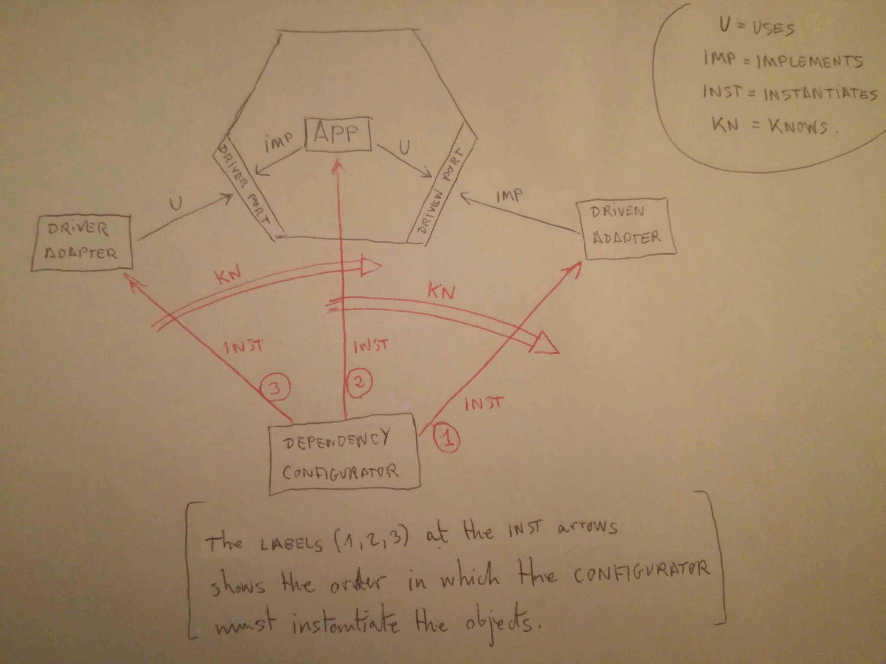

# Ports and Adapters Pattern

- **url** = https://jmgarridopaz.github.io/content/hexagonalarchitecture.html
- **type** = série d'articles
- **auteur** = [Juan Manuel GARRIDO DE PAZ](https://jmgarridopaz.github.io/) = _Programmer since 1985_
- **date de publication** = 2018-08-29
- **source** = [son site dédié à l'archi hexagonale](https://jmgarridopaz.github.io/content/articles.html)
- **tags** = language>agnostic ; topic>architecture  topic>architecture-hexagonale ; level>intermediate

TL;DR : site très touffu mais très détaillé expliquant l'archi hexagonale, et montrant concrètement comment l'implémenter ; très très utile à un profil comme le mien qui a besoin de voir le concret pour inférer la connaissance générale. Approuvé par Alistair COCKBURN himself. J'apprécie particulièrement qu'il ne passe pas sous silence le rôle du main.

* [Ports and Adapters Pattern](#ports-and-adapters-pattern)
   * [Ports and Adapters Pattern — (Hexagonal Architecture)](#ports-and-adapters-pattern--hexagonal-architecture)
         * [2.5.- SUMMARY](#25--summary)
      * [misconceptions](#misconceptions)
      * [pros/cons](#proscons)
      * [quand utiliser l'archi hexagonale ?](#quand-utiliser-larchi-hexagonale-)
      * [implémentation steps](#implémentation-steps)
   * [Hexagonal Architecture: An implementation guide](#hexagonal-architecture-an-implementation-guide)
      * [Intro Chapter](#intro-chapter)
      * [Chapter 1: APPLICATION DESIGN](#chapter-1-application-design)
         * [3.3.- ADD ADAPTERS](#33--add-adapters)
      * [Chapter 2: PROJECT STRUCTURE](#chapter-2-project-structure)
         * [3.- DEPENDENCIES.](#3--dependencies)
         * [4.- MODULES vs LAYERS.](#4--modules-vs-layers)
      * [Chapter 3: DEVELOPMENT SEQUENCE](#chapter-3-development-sequence)

La première partie est une explication de l'archi hexagonale, la seconde montre tout le process pour l'utiliser concrètement sur un projet, from scratch.

(comme j'ai beaucoup lu sur le sujet, je n'annote que les trucs nouveaux que j'apprends)

## Ports and Adapters Pattern — (Hexagonal Architecture)

https://jmgarridopaz.github.io/content/hexagonalarchitecture.html

> There are two kinds of driven actors:
>
> - Repository: The application can also obtain information from it, besides sending. For example, a database or any other storage device.
> - Recipient: The application just sends information to it and forgets about it. For example, a SMTP server for sending emails.

^ distinction intéressante pour s'y repérer

> Depending on the granularity we apply when grouping functionality, we can have a port interface with many use cases or with just a few. If we want to follow the Single Responsibility Principle, then we would have a lot of ports, each one for a use case.

^ pas de guideline stricte sur comment organiser ses driver ports.

> driver ports are said to be the use case boundary of the application. They are the API of the application.

^ les drivers ports sont l'API de l'application.

> A driven port is an interface for a functionality, needed by the application for implementing the business logic. Such functionality is provided by a driven actor. So driven ports are the SPI (Service Provider Interface) required by the application

^ dénomination de **Service Provider Interface**, même si je ne l'aime pas beaucoup.

> A driver adapter uses a driver port interface, converting a specific technology request into a technology agnostic request to a driver port.

^ pour faire le lien avec ma prez, j'ai deux "technologie requests" différentes pour déplacer le marker : une avec le clic-gauche sur la carte, l'autre avec l'appel direct d'une fonction par un player automatique. Il donne plusieurs exemples concrets :

> - An automated test framework: Converts test cases into requests to a driver port.
> - A CLI (Command Line Interface): Converts text entered in a console.
> - A GUI of a desktop application: Converts events triggered by graphical components.
> - An MVC web application: The Controller receives from the View the action requested by the user, and converts it into a request to a driver port.
> - A REST API controller: Converts REST API requests.
> - An event subscriber: Converts messages (events) from a message queue to which the application is subscribed.

^ c'est le genre d'exemple concret qui me parle bien mieux qu'une description théorique.

> For each driver port, there should be at least two adapters: one for the real driver that is going to run it, and another one for testing the behaviour of the port. (...)
>
> For each driven port we should write at least two adapters: one for the real world device, and another one a mock that mimics the real behavior.

^ le testing est une bonne occasion d'avoir au moins deux adapters par port.

> Which adapter to use for each port is something that is configured at application startup

^ c'est un des points que j'avais du mal à comprendre : il faut un main qui connait les vrais adapters, pour les passer (sous forme d'une interface) à l'application.

####  2.5.- SUMMARY

> - The Hexagon ==> the application
> - Driver Ports ==> API offered by the application
> - Driven Ports ==> SPI required by the application
> - Actors ==> environment devices that interact with the application
> - Drivers ==> application users (either humans or hardware/software devices)
> - Driven Actors ==> provide services required by the application
> - Adapters ==> adapt specific technology to the application
> - Driver Adapters ==> use the drivers ports
> - Driven Adapters ==> implement the driven ports

^ son résumé est très concis et bien.

Note que les deux types de ports ne sont pas symétriques : le monde extérieur UTILISE  les drivers ports, mais IMPLÉMENTE les driven ports.

En plus de tout ça, une partie importante (mais souvent passée à la trappe dans les explications) est **le main** : c'est lui qui instancie tout le monde et qui agence les composants, d'une façon très précise :

- D'abord il crée la "technology" (e.g. il lance une database)
- puis il instancie les driven adapters utilisant cette technologie
- puis il instancie l'application, en lui injectant les driven adapters
- puis instancie les driver adapters en leur passant l'app (ces adapters utilisent les driver ports)
- enfin il utilise les driver adapters instanciés

> In an actor-application interaction, the one that starts the conversation must know of the other, in order to know who to talk to, i.e. it must have a Configurable Dependency on an interface implemented by the other

^ un intéressante formulation : c'est celui qui initie la conversation qui doit recevoir son interlocuteur à la construction, afin qu'il sache à qui il va parler.

> the main goal of the architecture, that is, to have an application that can be run by several drivers and tested in isolation from recipients/repositories

^ rappel de l'objectif de l'architecture

> When the pattern was written in 2005, what the author wanted to show is that the asymmetry of the traditional layered architecture (user side vs data side), was in fact symmetrical. He did it by drawing an hexagon and putting both UI and database outside. Database is the same as UI, just technology

Intéressant historique ; le keypoint est la dernière phrase : _Database is the same as UI, just technology_

> So what’s the conclusion? Is Ports & Adapters symmetrical or asymmetrical?
>
> The corollary is that both symmetry and asymmetry coexists:
>
> - Symmetry: All the adapters, both driver and driven, depends on the hexagon. The application is technology agnostic in both sides.
> - Asymmetry: Configurable Dependency implementation is different for each side. In the driver side, the application doesn’t know about which adapter is driving it. But in the driven side, the application must know which driven adapter it must talk to.

^ autre intéressant point de vue : selon ce qui nous intéresse (concept derrière l'archi, ou implémentation concrète), l'archi hexagonale est à la fois symétriques et asymétrique.

### misconceptions

Derrière, il y a un chapitre intéressant sur les misconceptions :

- il n'y a pas de layers qui s'empilent, juste l'hexagone et le monde extérieur
- la forme de l'hexagone est juste pratique à dessiner, mais n'a aucune importance réelle, ça pourrait être un carré ou un octogone
- les ports doivent être dans l'heaxgone (ils sont l'interface de l'hexagone, sa frontière)

### pros/cons

Puis, il y a un chapitre sur les pros/cons.

Pros :

-  Testabilité (on peut tester le core en isolation)
-  Maintenabilité (car la business logic est découplée de la technologie)
-  flexibilité (on peut swapper la technologie utilisée)
-  le coeur fonctionnel est protégé des évolutions de la technologie
-  on peut retarder les décisions technologiques

Cons :

- complexe  : des modules, du code, des interfaces, des dépendances
- temps de build (conséquence du point précédent)
- indirections + conversions :
    > Decoupling application from technology through ports and adapters adds indirection, i.e. extra calls to methods when an adapter converts between port and specific technology interfaces. Besides that, a mapping between application and ouside world objects, may be needed.

Quand il parle du testing, il donne une définition des tests de Nat PRYCE (et depuis mes déboires sur le testing, je suis vigilant sur ce sujet !) :

> - Unit Tests: For testing single objects inside the hexagon.
> - Integration Tests: For testing adapters. They ensure that translation between ports and the outside world is done by the adapters correctly.
> - Acceptance Tests: For testing driver ports, i.e. the hexagon in isolation. They check that application behaves as the user expects, meeting the acceptance criteria he/she previously defined for the use cases.
> - System Tests: For testing the whole system, adapters and the hexagon together. They also test system deployment and startup.

### quand utiliser l'archi hexagonale ?

Il enchaîne en précisant que sur de petits projets , la complexité additionnelle n'en vaut pas forcément la chandelle.

### implémentation steps

Enfin, de façon vraiment intéressante, il explique dans quel ordre implémenter son app :

- commencer avec une boîte noire comme hexagone, munie de ports (et c'est pas très grave si tout ça n'est pas très sec, et ne s'affinera qu'en implémentant l'hexagone)
- step 1 = testing driver adapters + mocked driven adapters. On code les mocked driven adapters au fur et à mesure qu'on en a besoin par les driver adapters. At this point the hexagon is complete, with tests at driver side and mocks at driven side. The application can be tested in isolation.
- step 2 = REAL DRIVER ADAPTERS / MOCK DRIVEN ADAPTERS (à ce stade, on continue de n'utiliser que des mocks pour les driven adapters)
- step 3 = TEST DRIVER ADAPTERS / REAL DRIVEN ADAPTERS. Ça nous permet de tester les vraies implémentation des driven adapters
- step 4 = REAL DRIVER ADAPTERS / REAL DRIVEN ADAPTERS. L'application est complete, on peut faire un test end-to-end

## Hexagonal Architecture: An implementation guide

Nouvelle série d'articles = exemple d'implémentation.

https://jmgarridopaz.github.io/content/hexagonalarchitecture-ig/intro.html

### Intro Chapter

> Allow “users” (a human being, another application, a batch script, …) to drive the application “in isolation” from real world devices (databases, files, servers, other applications, …). In particular, test cases are also drivers of the application. Therefore, Hexagonal Architecture allows business logic to be tested in isolation.

^ résumé de l'objectif de l'architecture

> At that point the business logic will be done. What will be left is adding real adapters for the UI, database, etc.

^ une critique que j'ai sur l'archi hexagonale, c'est qu'ils minimisent l'importance de ceci, qui peut représenter une proportion importante des SLOC de l'application (notamment l'UI), ou qui peut représenter un élément différenciant de l'entreprise (toujours l'UI).

> In this article I want to show an implementation guide for describing the structure, the development process, and the startup of a hexagonal architecture application

^ l'objectif de la série, c'est de montrer un exemple concret d'implémentation suivant les principes de l'architecture hexagonale.

Il donnera ses exemples en java 9

### Chapter 1: APPLICATION DESIGN

https://jmgarridopaz.github.io/content/hexagonalarchitecture-ig/chapter1.html

> We will develop an example application called BlueZone, that allows car drivers to pay remotely for parking cars at regulated parking areas in a city

^ l'application fil rouge ; il détaille le fonctionnel souhaité. Notamment, il y a deux types d'utilisateurs : regular, qui utilisent une webUI, et admin, qui utilisent une CLI.

> The steps of this designing process are:
>
> - Identify actors
> - Identify ports
> - Add adapters
> - The whole picture
> - Driver ports
>
> So that finally we should have the following information, that could be considered the output of this process and the starting point for the next chapters:
>
> - A diagram showing the components of the system: Hexagon (with ports), actors and adapters.
> - Driver ports in detail: Input, output and description of driver ports operations.
> - We will not define driven ports in detail yet, since we will find out their operations later on, as we develop the business logic.

^ l'ordre dans lequel faire les devs.

NDM : un gros point un peu irréaliste de cet exemple, est que le fonctionnel est précisément connu et clairement exprimé avant que le dev commence. Dans la vraie vie, c'est rarement comme ça (mais c'est pas très grave car le principe du design reste le même y compris si l'application n'est pas sèche et va évoluer avec l'évolution du fonctionnel souhaité).

> Drivers (actors) are those who need the application for achieving their goals.

^ à garder en tête

> As Alistair Cockburn says in his talk Alistair in the Hexagone, think of the application as a thing resting in a quiet state, doing nothing. When the driver needs the application to perform an action, the driver would kick it and wake it up saying “Hey you, do this”.

^ une façon de voir l'application, et l'interaction entre ses utilisateurs et elle.

> the triggering of the conversation has to do with dependency knowledge, in the sense that the one who triggers the interaction has to know the dependency.

^ un point intéressant : c'est celui qui trigge la conversation qui doit connaître la dépendance (pour "appeler" celle-ci).

> At this early stage of development we don’t care if actors are humans, files, databases, remote systems, etc. We just abstract the actor as a thing outside the application, it doesn’t matter the technology it uses.

^ c'est l'un des gains de l'archi hexagonale !

> An application (driver) port has a purpose, it is “for doing something”, and we should name ports that way, even in source code.

^ les driver ports doivent identifier clairement l'action qu'ils permettent de faire.

> For each driven actor, ask to yourself: What purpose does the application want the driven actor for? The answer will be the name of the port

^ même principe pour les driven ports = on les nomme en identifiant ce pour quoi l'application en a besoin.

> Maybe at this early stage of development, you still don’t know all driven actors needed by the application. But don’t worry about it, they will appear when you implement the business logic

^ c'est pas un souci que les ports ne soient pas secs et définitifs.

#### 3.3.- ADD ADAPTERS

> For every port, we will have at least two adapters:
>
> - What I call the “Default adapter”: It is the one that will be used when we want to test the hexagon in isolation. (...)
> - What I call the “Real adapter”: It is the one that will be used when running the application in production environment.

^ on a au moins deux adapters par port : un pour les tests, et un autre pour la prod.

> For every driver port, do the following:
>
> - Write down the sequence of interactions that take place when a driver actor uses the port. (...)
> - Identify and write down the names of the operations you found.
> - For every operation, describe the input it receives, the output it returns, and what it does.
> - Once you’ve done this, you will have defined the API of the hexagon.

^ comment définir ses usecase. NDM : j'aime aussi l'exercice de "faire une application CLI" pour identifier ce qui va dans l'adapter et ce qui reste dans l'hexagone, comme ce que j'ai fait pour le viewer d'itinéraires puis pour ma prez.

Ce qui est intéressant, c'est qu'à partir des specs de l'application, il montre sa réflexion pour définir ses use cases puis définir l'API du port correspondant en java.

Derrière, il y a un laïus sur les liens entre l'archi hexagonale et une autre méthode de design pat Cockburn, appelée "usecases".

> In hexagonal architecture, interactions link driver actor goals with application responsabilities. The operations that the application offer at a driver port are application responsabilities related to the purpose of the port.
>
> So the application is structured grouping responsabilities in ports acording to a purpose, which is the actor goal.

^ lien entre design des ports et objectifs des utilisateurs de l'application.

> In the right side of the hexagon… To perform its responsabilities, the hexagon will have to achieve goals. For achieving these goals it might need to interact with external systems (driven actors) through driven ports. These interactions link application goals with driven actor responsabilies.

^ de l'autre côté, lien entre les objectifs de l'hexagone et design des driven ports.

### Chapter 2: PROJECT STRUCTURE

> The example application is called BlueZone, and it is described and designed in Chapter 1.

^ l'article précédent nous a permis de designer l'application.

> In this chapter we will see how to organize the source code in modules using Java 9, dependencies between modules (“who knows of whom”), and how to configure those dependencies

^ cette vision très concrète des modules et de "qui connait qui" me manque souvent dans les articles sur l'archi hexagonale.

Bon, les explications sont en java, pas ce qui m'intéresse le plus non plus, mais au moins c'est concret.

> The important thing with this way of naming modules, is that when we see a module name at first glance, we know whether it is business logic or it deals with real world technology, since the first word after the application name is either “hexagon” or “adapter”.

^ nommage permettant de distinguer ce que j'ai appelé l'inside-world et l'outside-world dans ma prez.

> Hexagonal Architecture pattern says nothing about how to structure the source code of the hexagon.

^ à la différence éventuellement d'autres patterns d'archi, l'archi hexagonale ne s'intéresse pas à la structure du code à l'intérieur de l'hexagone.

> This way ports are grouped by their side (driver/driven), so that we see at a first glance whether the port is driver or driven

^ nommer les ports driver/driven pour facilement identifier de quoi on parle.

> Ports are named following the forDoingSomething pattern, saying what they are for, in a technology agnostic way from the application point of view, i.e. no matter the technology of the actor that is behind the port.

^ il nomme les ports avec un nom exprimant une action, et d'une façon indépendante de l'adapter.

> The business logic (hexagon source code) organization fall out of the scope of Hexagonal Architecture pattern (...) you can structure this source code however you want to, it is not a Hexagonal Architecture issue.

^ pour rappel, l'archi hexagonale ne dit rien sur la structure du code à l'intérieur de l'hexagone.

> As an example, the simplest way in Java to implement a hexagon would be just one class, implementing driver port interfaces, and depending on driven port interfaces

^ comme cas extrême illustrant ceci, on peut imaginer n'avoir qu'une seule classe qui utilise les interfaces des driven port, et qui implémente les interfaces des driver ports

> A usual way of structuring the hexagon is to split it into two layers: application and domain, following DDD (Domain Driven Design) rules, but this has nothing to do with Hexagonal Architecture.

^ même si l'archi hexagonale ne prescrit rien, une bonne pratique est de séparer :

- le domaine (NDM = ce qui serait identique entre deux applications différentes concernant le même métier)
- et l'application (NDM = ce qui, à l'intérieur de l'hexagone, serait différent entre deux applications différentes concernant le même métier)

Derrière, il crée un module par adapter, en les nommant à la fois avec le port correspondant et avec la technologie de l'adapter.

> During my researching on hexagonal architecture, I’ve studied several techniques for implementing the application startup, and I will show them in detail along the next articles in these series.

^ la question de savoir comment lancer l'application, instancier les adapters, faire l'injection de dépendance, etc. n'est pas triviale ! (NDM pourtant souvent passée sous silence dans les ressources sur l'archi hexagonale)

#### 3.- DEPENDENCIES.

Il rappelle les dépendances :

- l'hexagone ne dépend de personne
- les adapters dépendent de l'hexagone, et de la technologie utilisée par l'adapter
- le startup module (NDM : souvent oublié !) dépend de tout le monde

Il rappelle l'ordre de construction, où grosso-modo, on instancie les dépendances avant ce qui en dépend :

- on instancie des adapters pour les driven ports
- on instancie l'hexagone en lui injectant ces adapters
- on instancie des adapters pour les driver ports, en leur injectant l'hexagone

> The one who does the triggering has to know the dependency.

^ celui qui initie la conversation doit connaître sa dépendance, d'où l'ordre d'instantiation.

Il y a une image assez résumante, que je reproduis :

NDM : un point qu'il fait bien apparaître sur son image, et qui manque habituellement : il n'y a pas que 3 entités (driver adapters + hexagone + driven adapters), il y en a une quatrième = le module qui instancie tout le monde !

#### 4.- MODULES vs LAYERS.

Il insiste sur le fait que l'archi hexagonale ne guide pas vraiment comment architecturer son appli, c'est plutôt un pattern pour organiser ses objets et leur dépendances.

Il donne deux exemples d'archis différentes auxquelles on peut appliquer le pattern d'archi hexagonale = component-based et layered.

Ces archis guident l'organisation du code (sujet sur lequel l'archi hexagonale est effectivement muette).

Il insiste enfin sur trois points qui (apparemment) différencient l'archi hexagonale d'autres archis :

> - Ports are not a layer themselves. Ports are part of the hexagon, they are interfaces that belong to the business logic of the application, i.e. to the hexagon.
> - An adapter depends on the hexagon at one of its ports. An adapter is a piece of software playing a role (driver/driven) against a port
> - Adapters are independent from each other. An adapter doesn’t know of the others, it just depends on the hexagon, and on the actor whose technology it is adapting (for example a database).

### Chapter 3: DEVELOPMENT SEQUENCE

https://jmgarridopaz.github.io/content/hexagonalarchitecture-ig/chapter3.html

Cette partie explique dans quel ordre implémenter quoi quand on démarre un nouveau projet en archi hexagonale :

- d'abord un driver adapter de test (avec un hexagone hardcodé)
- puis des driven adapters mockés, avec l'hexagone: à ce stade, l'hexagone peut déjà être définitif !
- puis, on implémente les vrais driver adapters, en les testant avec les driven adapters mockés
- puis on implémente les vrais driven adapters, en les testant avec des drivers mockés
- enfin, on branche les vrais des deux côtés

Le tableau explicatif est très bien 👍

NDM : c'est l'implémentation des vrais driven adapters qui force à choisir la technologie du projet (e.g. la database), et on voit qu'on travaille dessus en dernier, et notamment après l'hexagone : on a retardé le moment de faire des choix technologiques.

La suite de la page est censé être l'application concrète de cet ordre de développement à son application fil rouge, mais il n'y a que le début : la page (et le reste du site) est toujours un work-in-progress.

Du coup, ça clôt un peu abruptement ces annotations 😅 mais même pas terminé, ce site reste une mine d'or !
