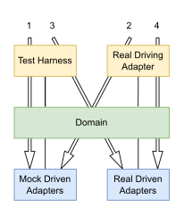

# Ports & Adapters (aka hexagonal) architecture explained

- **url** = https://codesoapbox.dev/ports-adapters-aka-hexagonal-architecture-explained/
- **type** = post
- **auteur** = [Daniel FRĄK](https://github.com/daniel-frak) = _I'm an experienced web developer, focusing on software craftsmanship and good architecture_
- **date de publication** = 2022-08-19
- **source** = [son blog](https://codesoapbox.dev)
- **tags** = language>agnostic ; topic>architecture  topic>architecture-hexagonale ; level>intermediate

TL;DR : yet another article on hexagonal architecture.

> This architectural style goes hand-in-hand with Eric Evans’ Domain Driven Design and so it is a good idea to familiarize oneself with DDD 

^ ça tombe bien, j'ai acheté le bouquin.

> Being a practitioner of Domain-Driven Design, I think a better name for it is “the Domain”, as this is the heart of software where business logic lies. 

^ j'aime bien ce nom **Domain**, il est plus parlant que hexagone.

> The domain should not hold any references to frameworks, technologies or real world devices and should contain all of the business logic of the application.

^ NDM = avant de comprendre l'archi hexagonale, lire ça ne t'aide pas, tu te demandes juste "comment"

> A driven actor can be either:
>
> - a Recipient – only receives information from the domain; e.g. a printer or message queue (as a publisher)
> - a Repository – can both provide information to the domain and receive it; e.g. a database or file system

Cette distinction **Recipient** vs. **Repository** est facultative pour la compréhension de l'architecture hexagonale, mais je l'aime beaucoup, notamment car elle aide à comprendre le flow de l'information. De plus, elle aide à nommer des classes.

> A port can be considered a group of interactions with a specific purpose

^ j'aime bien cette vision des choses : un port, c'est une façon d'interagir avec notre app, dans un but spécifique.

> It could be said that the adapters are a translation layer between the domain and the outside world.

^ j'aime bien cette vision aussi : un adapter, c'est une couche de traduction entre le monde extérieur et le domain.

> The recommended steps to developing a feature (in terms of what kind of adapters to use) in this architecture are as follows:
>
> test harness, mock driven adapters
> real driving adapter, mock driven adapters
> test harness, real driven adapters
> real driving adapter, real driven adapters

^ il donne un schéma qui est plus clair que le tableau d'hexagonalme, pour indiquer l'ordre selon lequel développer son application :

> Architectural examples are often not very prescriptive, leaving the reader to figure out the details on their own. The Ports & Adapters pattern itself is vague about the details. Because of this, I have decided to show a more complete implementation in the form of a package structure diagram for a web based application, in hopes of providing a more useful starting point.

^ Derrière, il donne un exemple concret. S'il a le mérite d'aller plus loin que beaucoup de ressources sur le sujet qui se contentent de grandes phrases en mode "cours magistral", son exemple ne décrit que l'organisation des modules, et on a donc du mal à comprendre concrètement ce qu'est un port, un adapter, ou l'hexagone.
