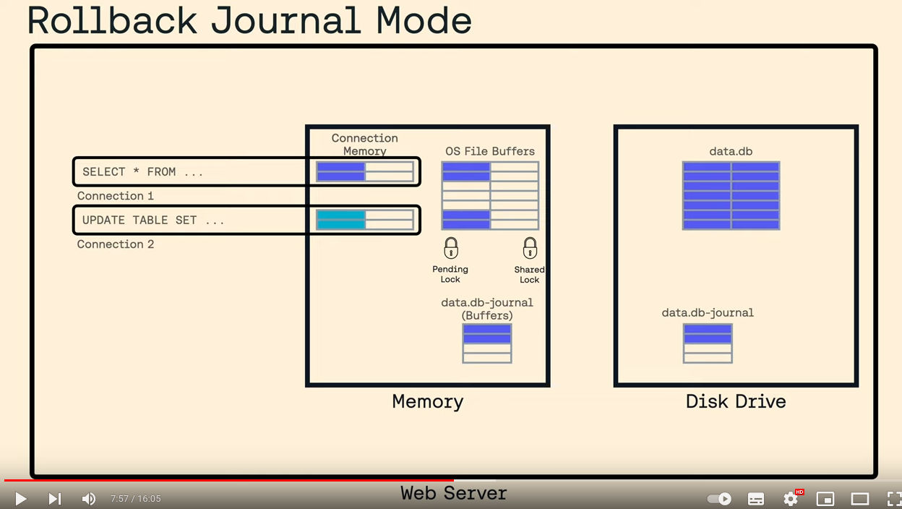

# SQLite For Beginners: Journal Modes

- **url** = https://www.youtube.com/watch?v=86jnwSU1F6Q
- **type** = vidéo
- **auteur** = [James MOORE](https://www.linkedin.com/in/knowthen?original_referer=https%3A%2F%2Fwww.google.com%2F), _Principal Instructor at mycelial.com_
- **date de publication** = 2022-10-28
- **source** = [la chaîne youtube de Mycelial](https://www.youtube.com/@mycelial1653/about), Mycelial commercialisant [Mycelite](https://mycelial.com/docs/), _Mycelite is an SQLite extension that allows you to synchronize changes from one instance of SQLite to another._
- **tags** = language>agnostic ; topic>sqlite ; topic>write-ahead-logging ; topic>WAL ; topic>rollback-journal ; level>beginner

TL;DR = cette courte vidéo explique très bien le rôle (similaire) du rollback-journal et du WAL, pourquoi ils sont nécessaires, et la différence entre les deux.

En résumé : les deux permettent de faire en sorte que les transactions soient ACID et notamment de garantir des commits et rollbacks atomiques même avec 1. plusieurs users concurrents et 2. des risques de coupures de courant à tout instant. Le WAL est quasi-systématiquement plus intéressant, mais n'est pas utilisable tout le temps.

La vidéo étant très bien expliqué mais tout de même courte : ne pas hésiter à la regarder de nouveau si besoin.

Des infos complémentaires sont sur [la doc officielle du WAL](https://www.sqlite.org/wal.html).

----

00:15 l'une des configs SQLite les plus importantes est le choix du WAL ou du rollback-journal (qui est la valeur par défaut), via `PRAGMA journal_mode`.

01:30 explication des différentes versions des fichiers qui existent sur disque et en RAM à un instant T :

- la database est stockée sur disque dur
- des journaux sont aussi stockés sur disque à côté de la database (leur usage différe selon le mode choisi)
- les fichiers du disque sont chargés en RAM dans les buffers de l'OS (donc côté kernel)
- enfin, on a également une version de certaines données dans la RAM (userland) qui gère la connexion à la base par l'utilisateur

Dans une situation idéalisée, sans coupure de courant, et sans journaux, une requête write d'un client créé les actions suivantes :

1. les données pertinentes sont chargées depuis le disque vers l'os-buffer
2. puis elles sont copiées depuis l'os-buffer vers la connexion en RAM, en userland
3. la connexion modifie les données en RAM userland pour effectuer le write requêté
4. le buffer userland est copié sur l'os-buffer
5. l'os-buffer est fsync sur le disque

02:50 plus en détail :

- quand on reçoit une requête en lecture, la connexion acquiert un shared-lock (autorisant plusieurs concurrent readers, y compris de nouvelles connexions, mais pas de writers)
- les données refont les étapes 1 et 2 pour atteindre la connexion
- note : une fois un bout du fichier sqlite en RAM dans l'os-buffer, les requêtes suivantes pour le même bout de fichier seront beaucoup plus rapides.
- si une requête write arrive, le temps que les étapes 1 à 3 soient faites, la connexion qui la traite acquiert un reserved lock (il ne peut y en avoir qu'un en même temps) ce qui laisse la possibilité de faire des reads (y compris de nouveaux reads venant de nouvelles connexions), mais pas de write.
- plus tard, quand le write aura été fait dans les buffer en userland (étape 3), le lock est promu en pending lock, qui autorise les read en cours à terminer leur lecture, mais empêche SQLite d'accepter de nouveaux readers ou writers, jusqu'à ce que le write soit fini.
- puis, lorsque tous les read qui restaient ont fini, le lock est de nouveau promu en exclusive lock, qui autorisera le write effectif sur la DB (ou plutôt sur les os-buffers qui la contiennent).

C'est là que le rollback-journal intervient :

- avant de faire des modifs sur la base, on copie sur le disque dur (avec un fsync pour être sûr que cette copie soit bien pérenne) les pages de la DB sur le point d'être modifiées. Cette copie constitue le **rollback-journal**.
- si tout se passe bien (pas de coupure de courant), on effectue les 5 opérations pour modifier les pages et les pérenniser sur disque ; une fois que c'est fait, on supprime la copie, ce qui constitue le commit de la transaction.
- si le serveur crashe en cours de route, par exemple à cause d'une coupure de courant, la DB est possiblement dans un état corrompu (car la coupure de courant a pu survenir alors qu'on était en cours de fsync, p.ex.), et le rollback-journal n'a pas été supprimé.
- au redémarrage après le crash, SQLite va constater qu'il existe un rollback-journal, en déduire qu'une opération de write ou une transaction a été interrompue avant d'être menée à terme, et recharger le rollback-journal
- on copie les pages depuis le rollback-journal vers la DB, en écrasant au passage l'éventuel état corrompu sur la DB

En résumé, le rollback-journal sauvegarde l'état de la DB avant de la modifier, pour pouvoir la restaurer en cas de souci.

05:30 le A de ACID (= atomicity) s'assure que quand on fait une transaction, la DB la voit :

- soit entièrement
- soit pas du tout

Le rollback-journal sert à avoir le cas "pas du tout" si quelque chose se passe mal en cours de transaction.

Note impactant les perfs : même quand tout se passe bien, on a besoin de DEUX fsync : une fois pour pérenniser la création du rollback-journal, et une fois pour pérenniser le write sur la DB.

09:30 le rollback-journal peut ou non être "hot" (un rollback-journal hot doit être rechargé au démarrage, ça n'a pas l'air d'être systématiquement le cas, mais je n'annote pas sa (brève) explication).

10:30 **le WAL** c'est le contraire = toute modification est écrite dans le "journal" plutôt que dans la DB.

La conséquence, c'est que pour connaître l'état de nos données, on a DEUX choses à consulter : la DB et le WAL : l'état de la DB n'est plus suffisant à lui tout seul pour connaître ses données. En quelque sorte, la DB sert de version initiale sur laquelle s'applique un diff = le WAL.

Le write est plus simple :

- les données sont écrites dans le buffer en userland
- puis dans l'os-buffer du WAL (et non de la DB !)
- puis l'os-buffer du WAL est pérennisé sur le disque avec un fsync

Note : pour faire un write, on n'a donc pas besoin de lock ! C'est une différence importante avec le rollback-journal (et sans doute ça qui explique que le WAL est plus rapide).

Tous ces write successifs font grossir le WAL, et c'est quand un seuil (configurable, par défaut 1000 pages) est atteint que le WAL est finalement intégré dans la DB, ce qu'on appelle le checkpoint (effectué par la requête qui a dépassé le seuil : tous les writes sont très rapides, sauf un de temps en temps qui est très lent).

Note importante = en dehors éventuellement des checkpoints (et encore : d'après la doc uniquement, car plus tard dans la vidéo vers 13:00, il dit que les writers ne vont pas faire de checkpoints des pages sous un endpoint) aucun write ne locke la database ! Pour éviter que les readers et writers concurrents ne se marchent dessus, le premier truc que faire un reader est de noter le dernier commit dans le WAL à utiliser, l' `end mark`. Ainsi, même si des writers écrivent en même temps que le read, leurs modification seront écrites **après** ce ̀`end mark`, et seront donc ignorées par le read (mais pas par de futurs reads !).

Derrière, le reader regarde si la page qui l'intéresse apparaît dans le WAL (en commençant par la fin = les pages les plus récentes) : si oui, il utilise la page DU WAL. Si non, il fallback sur la page de la DB, en faisant comme si le WAL n'existait pas.

13:30 quand le serveur crashe avant d'avoir pérenniser un write, la fin du WAL est possiblement corrompue (par exemple il manque le commit final). Au démarrage suivant, SQLite constate que le WAL est corrompu, il supprime le dernier write du WAL, ce qui revient à faire un rollback de la dernière transaction.

14:00 et si le crash a lieu au moment du checkpoint, i.e. du transfert des pages du WAL vers la DB, c'est encore plus simple, car ces pages de la DB qui sont corrompues à cause du crash (car le crash a pu avoir lieu au beau milieu de leur écriture) ne sont en fait jamais utilisées : tant que leurs alter egos existent dans le WAL (ce qui est le cas vu que le crash a empêché de vider le WAL) les pages équivalentes dans la DB sont ignorées. C'est au prochain checkpoint que ces pages corrompues dans la DB sont réécrites proprement.

15:40 = Avantages du WAL :

- significantly faster
- better concurrency
- less writes
- fast sequential writes
- fewer fsyncs
- better amortization of fsync

Inconvénients du WAL :

- no NFS support
- no atomic commits accross separate DBs
- might be slightly slower (1% à 2%) in read heavy apps
Todo = annoter à l'identique (ou prendre un screenshots) les d'avantages/ inconvénients de 15:35
