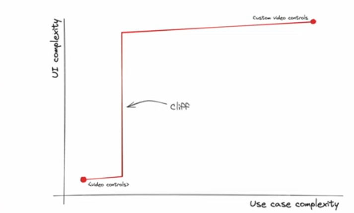

# API design is UI design

- **url** = https://www.youtube.com/watch?v=g92XUzc1OHY
- **type** = talk
- **auteur** = [Lea VEROU](https://lea.verou.me/) = membre du W3C, spécialisée en CSS
- **date de publication** = 2024-07-11
- **source** = [conférence dotJS 2024](https://www.youtube.com/@dotconferences)
- **tags** = language>agnostic ; topic>api ; level>intermediate

TL;DR = plein de conseils de bon sens sur l'API design, sur un talk à la fois court, agréable à écouter, et très utile. À noter : elle place ses exemples sur un graphique intéressant avec :

- en abscisse la complexité du usecase
- en ordonnée la complexité de l'utilisation de l'API

Quelques phrases clés :

> Api design is ux design

^ une api est une "interaction utilisateur" au sens large ; c'est juste une interaction utilisateur particulière, où l'utilisateur est un développeur.

Les usecases doivent driver le design, ils sont en quelque sorte les tests U de l'API.

> "Make simple things easy, Make complex things possible" Alan KAY

**Tip #1 = reveal complexity progressively**

^ pour éviter le cas de son exemple où l'API du DOM SVG nécessite de déréférencer 4 champs, simplement pour accéder au rayon d'un cercle.

08:00 très bon exemple d'interface dans le monde réel = un robinet :

- il y a deux usecases (deux besoins) : ajuster la température, et ajuster le débit de l'eau
- les modèles classiques ont deux boutons, un pour l'eau chaude, et un pour l'eau froide
- ils sont designés (et exposent une interface) autour de la façon dont ils sont implémentés = un tuyau d'eau chaude et un tuyau d'eau froide
- l'interface qu'ils exposent (= de quoi ajuster l'eau chaude + de quoi ajuster l'eau froide) est donc cohérente avec leur implémentation interne, et non avec les besoins
- a contrario, les mitigeurs plus modernes exposent une interface centrée sur le use case plutôt que l'implémentation : ils offrent un moyen d'ajuster la température, et un autre moyen _orthogonal_ pour ajuster le débit de l'eau

**Tip #2 = expose orthogonal controls for orthogonal concepts** (comme le mitigeur)

Deux exemples de trucs où permettre le cas simple est facile, mais où le cas complexe est impossible : HTML select et HTML video controls

_Usability cliff_ = le cas simple est certes facile à utiliser, mais le cas complexe est très très compliqué, au point d'être carrément une deuxième api différente. Il n'y a donc pas de transition linéaire entre les deux (= de montée en difficulté progressive).

Exemple concret = les contrôles d'une balise HTML video : si on veut utiliser les contrôles par défaut, c'est super simple, on a un simple tag HTML à ajouter à sa page. Mais si on veut des contrôles custom, on est obligés de recoder TOUS les contrôles nous mêmes (ce qui est très complexe) : il n'y a pas d'API qui nous permettrait de customiser "juste un peu" les contrôles par défaut.

Sur son graphique, la citation d'Alan KAY implique donc "juste" un point en bas à gauche et un point à droite (qui a le droit d'être haut) mais en pratique, on veut un peu plus que ça : on veut plutôt une courbe à peu près linéaire entre ces deux points !

15:00 elle donne un intéressant exemple de deux apis, qui se représentent différemment sur son graphique i.e. qui font des trade-offs différents entre ce que l'API permet de faire et sa complexité d'utilisation.

Son message = pour savoir laquelle des deux est la meilleure... on ne peut pas ! Pour ça, il faut obligatoirement connaître la fréquence des usecases. Son point est : il faut optimiser l'API pour les usecases fréquents et non pour des usecases rares, voire imaginaires.

16:00 "simple" dans la citation d'Alan KAY se réfère au usecase, pas à l'implémentation ! Le robinet classique rend l'implémentation easy, mais c'est bien le mitigeur qui rend le usecase simple, et qui est la meilleure des deux interfaces !

C'est toujours plus facile de changer une implémentation interne plus tard si on est partis sur une mauvaise implémentation, mais c'est beaucoup plus difficile de revenir corriger une API a posteriori.

18:00 il faut prioriser les utilisateurs sur les implémenteurs (i.e. rendre la vie des utilisateurs plus simple que la vie des implémenteurs). L'un des intérêts est que la complexité est positionnée sur "ceux qui peuvent la supporter" = les personnes les plus tech.

 19:00 **tip #3 No boilerplate = syntax should not require more than what is needed to declare intent**

 20:00 comment proposer une bonne API graduellement ? Deux approches qui partagent la même idée de "faire en plusieurs fois" (layers) :

 - Approche 1 :
     - commencer petit avec le MVP = les usecases fréquents (à rendre simples d'utilisation)
     - ils sont représentés par un petit segment (car peu de usecases sont rendus possibles) en bas à gauche du graphique (car ils sont simples d'utilisation).
     - Puis, avancer à chaque itération, linéairement, vers les usecases de plus en plus complexes, à rendre possible, de la façon la plus simple possible
 - Approche 2 :
     - commencer avec une API complexe pour le MVP
     - on a donc un grand segment (car beaucoup de usecases possibles) horizontal, en haut (car complexes d'utilisation)
     - puis abaisser la partie gauche du segement (=rendre les usecases fréquents de plus en plus simples), de plus en plus au fur et à mesure des itérations

 22:15 les tests utilisateurs ne sont pas réservés aux seules IHM, on PEUT user-tester les API ! (et il suffit de très peu de temps/personnes pour avoir de bons retours !)

 23:40 **tip #4 it's not the user's fault** ; si tous les utilisateurs utilisent mal l'API, c'est plutôt qu'elle est mal conçue

24:40 il faut tester soi même son API ! (Dogfooding) et si possible, le faire AVANT de l'implémenter

**Tip #5 = rester empathique** : s'intéresser aux utilisateurs
