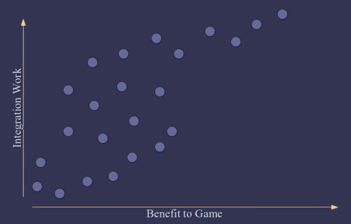

# Designing and Evaluating Reusable Components

- **url** = https://caseymuratori.com/blog_0024
- **type** = talk
- **auteur** = [Casey MURATORI](https://caseymuratori.com/about), dev et conférencier, spécialisé dans les game engines
- **date de publication** = 2004-??-??
- **source** = [son site](https://caseymuratori.com/)
- **tags** = language>agnostic ; topic>api ; level>intermediate

TL;DR = les principes d'une bonne API (dans son contexte où il dev des jeux vidéo) = permettre une intégration graduelle en terme de features/travail nécessaire pour intégrer + caractéristiques qui font d'une API une *bonne* API. NDM : ce talk a un objectif proche d'un [talk similaire de Lea VEROU](./2024-08-17-api-is-ux.md), mais je préfère celui de Lea VEROU, certes moins détaillé, mais plus moderne, plus général, plus succint, et mieux amené. Il fournit d'ailleurs un graphe très similaire, avec le "benefit to game" en abscisse, et l' "integration work" en ordonnées :

----

À 11:00 , il mentionne un message similaire à la **usability cliff** de Lea VEROU = si l'API ne permet pas une utilisation progressive, elle peut obliger le dev qui l'intégre à de gros gaps de travail. Il appelle ça **integration discontinuity**.

À 13:00 il en conclut que le premier objectif de l'API design est d'éliminer les discontinuités de l'API.

À 14:00 il illustre ce message sur son graphique : on veut une API avec beaucoup de "points" différents (i.e. de tradeoffs différents entre le travail d'intégration à investir et le ROI)

15:00 les 5 caractéristiques qui permettent d'évaluer une API. Chaque caractéristique a des conséquences différentes, et des tradeoffs différents :

- **granularity** : à quel degré une API A peut être découpée en deux sous-API B et C qui font les choses un peu différemment
- **redundancy** : dans quelle mesure au lieu d'utiliser A, on peut aussi utiliser B, qui fait les choses un peu différemment
- **coupling** : dans quelle mesure pour utiliser A, il faut obligatoirement utiliser aussi B
- **retention** : dans quelle mesure pour utiliser l'API A, il faut obligatoirement que le code appelant transfère une partie de ses données vers l'API, qui en fait une sorte de copie miroir
- **flow control** : "qui utilise qui ?" Est-ce mon code qui appelle l'API ? l'API qui me renvoie quelque chose ? Mon code qui est appelé par l'API ?

^ chaque slide donne une synthèse (peut-être revenir prendre des screenshots ?)

17:00 exemple de granularity : une API unique pour mettre à jour la granularity vs. trois api : une pour récupérer l'orientation actuelle, une pour calculer le diff à appliquer, et une pour setter la valeur mise à jour. Cette granularity supplémentaire autorise à customiser le comportement de l'API, mais est plus complexe. La granularity est donc une caractéristique parfois positive parfois négative

18:30 exemples de redundancy. Par exemple, orienter un objet selon une direction (Vector) ou bien vers un point (Point). Une façon de voir les choses = la redondance revient à proposer de grouper les 3 APIs mentionnées au point précédent selon plusieurs façons différentes : A+BC d'un côté et AB+C de l'autre : il y a donc plusieurs façons différentes de faire les mêmes choses, chacune avec ses avantages et inconvénients. Ici aussi, la redundancy est parfois positive, parfois négative. Ndm : pour faire le lien avec le talk précédent, ces différentes façons de faire les choses DOIVENT répondre à un vrai besoin (usecase) pour être pertinentes !

20:20 plusieurs exemples intéressants car très différents de coupling, notamment du couplage à un état interne, qui fait que plusieurs appels à l'API isolés ne sont pas indépendants, ou le fait d'avoir un seul appel qui mélangent plusieurs choses qui deviennent donc inséparables, ou encore le fait de devoir obligatoirement faire plusieurs appels différents pour que l'API fonctionne. À la différence des deux caractéristiques précédentes, le coupling est quasiment toujours négatifs.

23:40 exemples de rétention : devoir passer une data côté client (ownée et managée par le client) à l'API, (qui en fait sa propre copie) pour que l'API fonctionne : l'API fait de la "rétention" de ma donnée. Les exemples sont donc tous des variations autour d'une paire d'appels "setX + useAPI" où le setX est un appel préalable obligatoire à l'utilisation de l'API qui copie une de mes données vers l'API.

24:40 exemples de flow control : notre code (le game) appelle une librairie vs. (p.ex.) le game appelle une lib, si rappelle notre code vs. etc toutes les variations possibles. Plus il y a différents multiples échanges entre la lib et notre code, moins bon c'est, car ça rend difficile la construction d'un modèle mental de ce qui se passe.

26:45 résumé des caractéristiques et de ce qui est positif, négatif ou mitigé :

- **granularity : A or BC** : flexibility vs. simplicity
- **redundancy : A or B** : convenience vs. orthogonality
- **coupling : A implies B** : less is always better
- **retention : A = B** : synchronization vs. automation
- **flow control : A invokes B** : more game control is always better

28:30 les tradeoffs qu'on choisit ne sont pas forcément figés : on peut en choisir certains en début de projet et en choisir d'autres plus tard quand le projet mature

29:30 les 20 dernières minutes sont des exemples réels d'API et leur progression selon un critère, par exemple de l'API la plus grossière mais simple à l'API la plus complexe.

42:45 résumé des guidelines à suivre pour avoir une API agréable à utiliser :

- API which is gradually tiered
- highly decoupled
- has no retention at its most granular tier
- and always lets the game dictate the flow of control

44:40 le résumé de son talk en une minute ; Ndm = faire ça dans mes talks à moi aussi !

(Ici aussi, il recommande d'écrire l'utilisation de l'API avant son implémentation)
