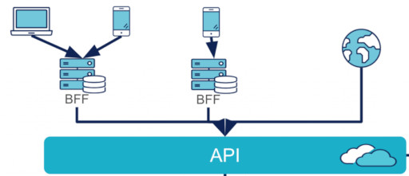

TL;DR = Un BFF (backend for frontend) est un service intermédiaire entre une app front et une API exposée par un backend. Un BFF est surtout utile quand il y a plusieurs clients différents, chacun avec des besoins un peu différents : l'objectif est que le backend puisse faire de l'**API first**, en exposant une unique API qui soit spécifique à son métier, plutôt que de faire une API qui essaye de s'adapter aux différents besoins particuliers de ses clients.

----

([un post sur le sujet sur le blog d'octo](https://blog.octo.com/les-indispensables-dun-projet-frontend-un-backend-for-frontend-une-api-sur-mesure))

# Contexte

Les backends veulent faire de l'API first i.e. expose leur métier sous la forme d'une API ; ils veulent l'exposer sous une forme bien adaptée à leur métier, et non adaptée à comment telle ou telle app les consommera.

Possiblement, les apps consommatrices sont certes celles de l'entreprise, mais également celles d'autres clients.

Exemple :

- Google Maps expose son service sous forme d'une API 
- cette API permet p.ex. d'afficher des trucs sur une carte, ou de connaître le temps de trajet d'un point à un autre
- elle est certes utilisée par l'app de Google...
- ... mais elle est également vendue à d'autres utilisateurs qui en font un usage différent :
    - e.g. les store-locators veulent afficher l'emplacement de leurs magasins sur une carte
    - e.g. le site des impôts veut permetre de calculer la distance à parcourir entre domicile et travail, pour calculer son indemnité kilométrique

Le besoin auquel un BFF répond est justement de permettre aux backends de faire de l'API first plutôt que de faire du spécifique aux apps.

# usecase 1 = plusieurs frontaux consomment la même API avec des besoins différents

Supposons qu'un même backend soit utilisé par plusieurs frontaux p.ex. :

- un site WEB
- une app ANDROID
- une app APPLE

Chaque app a ses spécificités, elles diffèrent légèrement les unes des autres, et ont besoin d'une réponse du backend légèrement différente (c'est du vécu).

**SANS BFF** : on a plusieurs façons de faire ça :

- une unique API exposée par le backend (qui expose tout ce qui est nécessaire à tout le monde), chaque client ne prend que ce qui l'intéresse dans la réponse
- 3 APIs distinctes exposées par le backend
- une unique API, mais qui est paramétrable pour les besoins de l'app

Chacune de ces solutions scalent mal, non seulement en terme de feature (le backend doit se synchroniser avec chaque frontal pour toute nouvelle feature), mais surtout avec le nombre de clients différents : si on a 1000 clients utilisateurs de l'API, aucune des approches décrites ci-dessus n'est utilisable.

**AVEC BFF** : problem solved, même pour 1000 clients :

- le backend ne propose qu'une seule et unique API, qui est commune à tout le monde
- un BFF se situe entre chaque frontal et le backend (dit autrement : un frontal n'a plus connaissance du backend, mais uniquement de son BFF)
- chaque BFF utilise la réponse (unique) du backend pour construire la réponse adaptée à son frontal

Intérêt = le backend peut être API-first = ne faire qu'une seule API adaptée à son métier, plutôt que de polluer son API avec les spécificités du client, et leur logique de présentation.

# usecase 2 = agrégation de requêtes

Supposons que :

- le backend fasse de l'API first et expose une API conçue pour son métier (plutôt que pour les spécificités de son app)
- pour l'exploiter l'app a besoin de faire plusieurs requêtes successives à l'API (et ce besoin d'aggrégation est considéré comme liée à la logique de présentation de l'app plutôt qu'au métier exposé par l'API)
- le réseau soit très lent : une requête depuis le smartphone vers le backend (ou le futur BFF) sera trèèèès lente
- (à l'inverse, une requête entre le BFF et le backend sera rapide, car le BFF tourne sur le même réseau que le backend)

**SANS BFF** : le smartphone doit faire plusieurs requêtes à l'API, donc l'utilisateur final doit attendre plusieurs fois la grosse latence → l'app est inutilisable.

**SANS BFF (version alternative)** : on modifie l'API pour qu'elle fasse elle-même l'agrégation → on s'est éloigné de API first, dans le sens où on a tordu le bras dans le dos de l'API pour lui faire traiter un cas spécifique à un client, au lieu de la laisser se concentrer sur son métier.

**AVEC BFF** : le smartphone fait une unique requête au BFF, et c'est le BFF qui effectue les multiples requêtes vers le backend (sans latence) pour construire une réponse agrégée ; l'utilisateur final ne doit attendre qu'une seule fois la grosse latence → l'app reste utilisable.

(à noter que pour ce usecase, le BFF présente un intérêt même s'il n'y a qu'un unique client)

# Notes vrac

C'est souvent l'équipe front qui maintient leur BFF, vu que celui-ci traduit la façon dont ce front en particulier utilise l'API :

> Comme le BFF est lié à une expérience utilisateur, il doit être maintenu par la même équipe qui est en charge du frontend.

L'app ne doit avoir connaissance que du BFF, et plus du backend :

> Même si, pour certaines données, le BFF fera peut-être passe-plat sur certaines routes, il est important que chaque appel de l’application frontend est effectué au BFF, et lui seul communique avec l’API pour renvoyer les bonnes réponses.

Le schéma OCTO ci-dessus est intéressant car il montre que ce sont "mes" apps qui passent par leur BFF : le monde extérieur tape sur l'API directement (et "leurs" apps ont sans doute leur propre BFF).

Autres intérêts architecturaux :

- il y a moins de logique métier côté client (car elle est dans le BFF)
- le backend n'a pas à avoir de responsabilité lié à la logique de présentation (car elle est dans le BFF)

