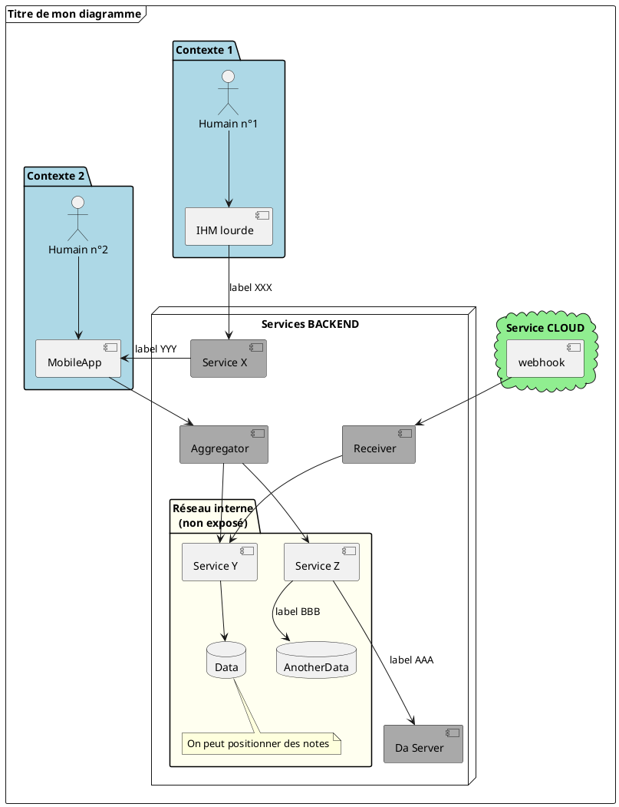

**CONTEXTE** = janvier 2026, j'essaye PlantUML (attention, la doc est blindée de pubs...)


# Installation :

En tant que service web, via docker :

```
docker pull plantuml/plantuml-server:jetty
docker run -p 8080:8080 plantuml/plantuml-server:jetty

# http://localhost:8080/
```

# Notes à l'usage

- extension = `my_file.puml`
- gitlab peut rendre directement du puml inliné via , via  :
    ```
    \`\`\`plantuml
    ```
- la liste des couleurs utilisables est [ici](https://plantuml.com/fr/color)


# Exemple :




